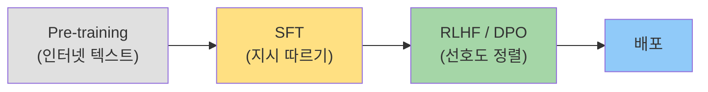
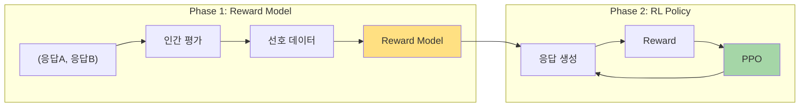
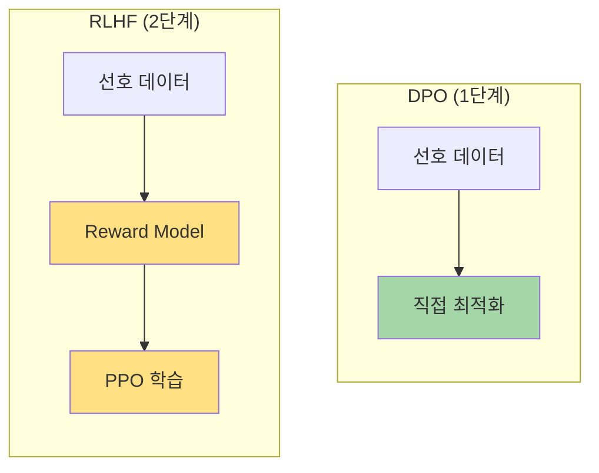
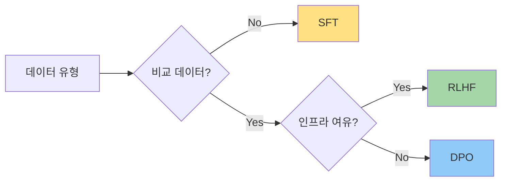
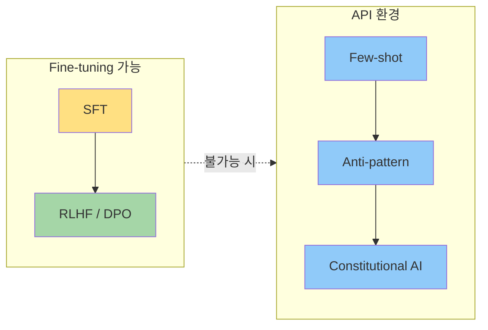

> **시리즈**: LLM 피드백과 학습
> - **Part 1**: SFT, RLHF, DPO 비교 (현재 글)
> - [Part 2: 피드백 수집 설계](/dev-notes/posts/2025-12-28-llm-feedback-collection-strategy/)
> - [Part 3: 피드백 활용 파이프라인](/dev-notes/posts/2025-12-28-llm-feedback-utilization-pipeline/)

## 들어가며

ChatGPT가 단순한 텍스트 생성기가 아니라 "도움이 되는 어시스턴트"처럼 동작하는 이유는 무엇일까? 사전학습(Pre-training)만으로는 불가능하다. 인터넷 텍스트를 학습한 모델은 "다음 토큰 예측"에 능숙할 뿐, 사용자에게 유용한 응답을 생성하는 방법을 모른다.

> "Pre-trained language models are not assistants. They are text completion engines."

이 간극을 메우는 것이 **Post-training**이다. SFT, RLHF, DPO는 모두 사전학습된 모델을 "정렬(Alignment)"하는 기법이다.



## SFT: Supervised Fine-Tuning

가장 단순한 방법이다. (질문, 이상적 응답) 쌍을 수집하고, 모델이 이 응답을 생성하도록 학습시킨다.

### 학습 데이터 형식

```json
{
  "messages": [
    {"role": "system", "content": "당신은 코드 리뷰 전문가입니다."},
    {"role": "user", "content": "이 함수의 문제점을 알려줘"},
    {"role": "assistant", "content": "SQL Injection 위험이 있습니다..."}
  ]
}
```

### 특징

| 장점 | 단점 |
|------|------|
| 구현 단순 | 고품질 데이터 수집 비용 높음 |
| 예측 가능한 결과 | "평균적인" 응답으로 수렴 |
| 도메인 특화 용이 | 다양한 선호도 반영 어려움 |

SFT만으로는 한계가 있다. 같은 질문에 여러 "좋은" 응답이 있을 때, 어떤 것이 더 좋은지 구분하지 못한다. 이 문제를 해결하는 것이 RLHF다.

## RLHF: Reinforcement Learning from Human Feedback

RLHF는 두 단계로 구성된다.



### Phase 1: Reward Model

인간이 "A가 B보다 낫다"고 평가한 데이터를 수집한다. 이 선호도를 예측하는 모델을 학습시킨다.

```
Prompt: "Python에서 리스트 정렬 방법"
Response A: "sorted() 함수를 사용하세요. 예시: sorted([3,1,2])"
Response B: "리스트를 정렬하려면 여러 방법이 있습니다. 첫째로..."

Human Preference: A > B (간결하고 예시 포함)
```

Reward Model은 이런 선호도 패턴을 학습하여, 새로운 응답에 점수를 매길 수 있게 된다.

### Phase 2: RL Policy (PPO)

Reward Model을 보상 함수로 사용하여, 높은 점수를 받는 응답을 생성하도록 모델을 학습시킨다. PPO(Proximal Policy Optimization)가 주로 사용된다.

### RLHF의 효과

> "RLHF-tuned models show dramatic improvements in helpfulness, harmlessness, and honesty compared to SFT-only models." — Anthropic

| 개선 영역 | 효과 |
|----------|------|
| Helpfulness | 사용자 의도에 맞는 응답 |
| Harmlessness | 유해 콘텐츠 거부 |
| Honesty | 불확실성 인정, 환각 감소 |

### RLHF의 문제점

| 문제 | 설명 |
|------|------|
| 복잡성 | Reward Model + RL Policy 두 단계 |
| 불안정성 | RL 학습의 고질적 문제 (reward hacking 등) |
| 비용 | 대규모 인간 평가 데이터 필요 |
| 재현성 | 하이퍼파라미터에 민감 |

이 복잡성을 줄이려는 시도가 DPO다.

## DPO: Direct Preference Optimization

DPO는 RLHF의 두 단계를 하나로 합친다. Reward Model을 명시적으로 학습하지 않고, 선호도 데이터로 직접 모델을 최적화한다.



### 핵심 아이디어

> "The optimal policy under RLHF can be expressed in closed form as a function of the reward model and the reference policy."

DPO 논문의 핵심 통찰이다. Reward Model을 거치지 않고, 수학적으로 동등한 목적 함수를 직접 최적화할 수 있다.

### 학습 데이터 형식

```json
{
  "prompt": "Python에서 리스트 정렬 방법",
  "chosen": "sorted() 함수를 사용하세요...",
  "rejected": "리스트를 정렬하려면 여러 방법이..."
}
```

RLHF와 동일한 선호도 데이터를 사용하지만, 학습 과정이 훨씬 단순하다.

### DPO vs RLHF 비교

| 항목 | RLHF | DPO |
|------|------|-----|
| 학습 단계 | 2단계 | 1단계 |
| Reward Model | 필요 | 불필요 |
| RL 알고리즘 | PPO 등 필요 | 불필요 |
| 학습 안정성 | 낮음 | 높음 |
| 데이터 효율 | 중간 | 높음 |
| 성능 | 기준 | 동등 또는 우수 |

### 실제 성능

DPO 논문에 따르면, GPT-4 기준 평가에서 RLHF와 동등하거나 더 나은 성능을 보였다. 특히 적은 데이터(수백~수천 개)로도 효과적이다.

## 세 방법 요약

| 방법 | 필요 데이터 | 복잡도 | 권장 상황 |
|------|------------|--------|----------|
| SFT | (질문, 응답) 쌍 | ⭐ | 도메인 특화, 응답 스타일 통일 |
| RLHF | 선호도 비교 데이터 | ⭐⭐⭐ | 대규모, 세밀한 정렬 필요 |
| DPO | 선호도 비교 데이터 | ⭐⭐ | RLHF 효과를 간단하게 |



## Fine-tuning 없는 대안

Claude API나 OpenAI API를 사용하는 환경에서는 모델 Fine-tuning이 불가능하다. 이때 사용할 수 있는 대안들이 있다.

### 1. Few-shot Learning

프롬프트에 좋은 예시를 주입한다.

```text
## 과거 좋은 평가를 받은 응답 예시

### 예시 1
질문: MR 리뷰해줘
좋은 응답: [우수 사례]

---
이제 다음 질문에 답해주세요:
```

Few-shot은 모델 가중치를 바꾸지 않고, 컨텍스트로 행동을 유도한다. 놀라울 정도로 효과적이다.

### 2. Anti-pattern 경고

반복되는 문제 유형을 프롬프트에 명시한다.

```text
## 피해야 할 응답 패턴
- 너무 장황함: 핵심만 간결하게
- 사실 오류: 불확실하면 모른다고 말하기
- 핵심 벗어남: 질문에 직접 답변
```

### 3. Constitutional AI 스타일 원칙

> "Constitutional AI trains models to be helpful, harmless, and honest by having them critique and revise their own outputs according to a set of principles." — Anthropic

문제 유형 태깅을 "헌법 원칙"으로 변환한다.

```yaml
principles:
  - name: "BE_CONCISE"
    critique: "응답이 불필요하게 길고 반복적입니다"
    revision: "핵심만 간결하게 전달하세요"

  - name: "STAY_ON_TOPIC"
    critique: "질문의 핵심을 파악하지 못했습니다"
    revision: "질문에 직접 답변하세요"
```

이 원칙들을 System Prompt에 포함시키면, 모델이 자체적으로 응답을 검토하고 수정하도록 유도할 수 있다.

### 4. System Prompt 최적화

피드백 분석 결과를 System Prompt에 영구 반영한다.

```text
## 응답 가이드라인 (피드백 분석 기반)

### 자주 발생하는 문제 (상위 3개)
1. 너무 장황함 (42%) → 핵심만 간결하게
2. 실행 불가능한 제안 (28%) → 구체적 단계 제시
3. 컨텍스트 무시 (15%) → 이전 대화 참조
```

### 대안 비교

| 방법 | 효과 | 구현 난이도 | 동적 적용 |
|------|------|-------------|----------|
| Few-shot | 높음 | 낮음 | ✅ 가능 |
| Anti-pattern | 중간 | 낮음 | ✅ 가능 |
| Constitutional AI | 높음 | 중간 | ✅ 가능 |
| System Prompt | 중간 | 낮음 | ❌ 고정 |

## 정리



| 환경 | 권장 방법 |
|------|----------|
| 자체 모델 운영 | SFT → DPO (또는 RLHF) |
| API 사용 (Claude, OpenAI) | Few-shot + Constitutional AI |
| 하이브리드 | System Prompt 최적화 + 동적 Few-shot |

Fine-tuning이 불가능해도, 피드백 데이터는 여전히 가치 있다. 우수 사례는 Few-shot 예제로, 문제 패턴은 Anti-pattern 경고로, 전체 분석은 System Prompt 개선에 활용할 수 있다.

## 참고 자료

### 논문
- [Training language models to follow instructions with human feedback](https://arxiv.org/abs/2203.02155) - InstructGPT (RLHF)
- [Direct Preference Optimization](https://arxiv.org/abs/2305.18290) - DPO 원논문
- [Constitutional AI](https://arxiv.org/abs/2212.08073) - Anthropic

### 튜토리얼
- [RLHF 101: A Technical Tutorial](https://blog.ml.cmu.edu/2025/06/01/rlhf-101-a-technical-tutorial-on-reinforcement-learning-from-human-feedback/) - CMU
- [RLHF Book](https://rlhfbook.com/) - Nathan Lambert
- [Understanding Reward Models](https://cameronrwolfe.substack.com/p/reward-models)

---

> **다음 글**: [Part 2: 피드백 수집 설계](/dev-notes/posts/2025-12-28-llm-feedback-collection-strategy/) - 어떤 피드백을 어떻게 모을까?
