Kafka는 분산 이벤트 스트리밍 플랫폼이다. 단순한 메시지 큐를 넘어 실시간 데이터 파이프라인과 스트리밍 애플리케이션의 핵심 인프라로 자리잡았다.

## 핵심 구성 요소

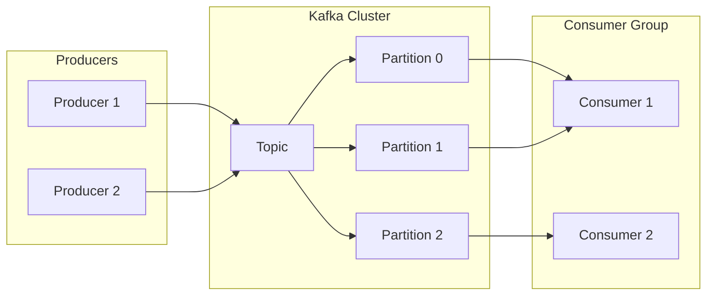

| 구성 요소 | 설명 |
|----------|------|
| **Topic** | 메시지가 저장되는 논리적 채널 |
| **Producer** | Topic으로 메시지를 발행하는 애플리케이션 |
| **Consumer** | Topic에서 메시지를 구독하는 애플리케이션 |
| **Consumer Group** | 협력하여 메시지를 분산 처리하는 Consumer 집합 |
| **Broker** | Kafka 서버, Partition의 Read/Write를 관리 |
| **Cluster** | 여러 Broker로 구성된 Kafka 시스템 |

## Topic과 Partition

Topic은 논리적 개념이고, 실제 데이터는 Partition에 저장된다.

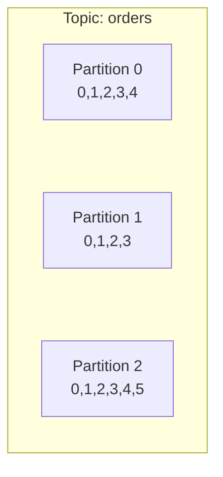

### Partition 특징

- 하나의 Topic은 여러 Partition으로 구성된다
- 각 Partition은 순서가 보장되는 불변의 메시지 시퀀스다
- Partition 수만큼 병렬 처리가 가능하다
- Partition 내에서만 순서가 보장된다 (Topic 전체 순서 X)

### Commit Log 구조

Partition은 Commit Log 자료구조를 사용한다.

> Commit Log는 추가만 가능하고 변경이 불가능한 데이터 구조다. 데이터는 항상 로그 끝에 추가되고 수정되지 않는다.

```
Partition 0:  [0] [1] [2] [3] [4] [5] ← 새 메시지 추가
                              ↑
                        현재 오프셋
```

### Segment

Partition의 데이터는 물리적으로 Segment 파일에 저장된다.

| 설정 | 설명 | 기본값 |
|------|------|--------|
| `log.segment.bytes` | Segment 최대 크기 | 1GB |
| `log.roll.hours` | Segment 롤링 주기 | 168시간 (7일) |

- Partition당 하나의 Segment만 활성화 상태 (쓰기 가능)
- 조건 충족 시 새 Segment가 생성되고 이전 것은 닫힌다
- 닫힌 Segment는 retention 정책에 따라 삭제된다

## Consumer Group

Consumer Group은 Kafka의 핵심 설계 중 하나다.

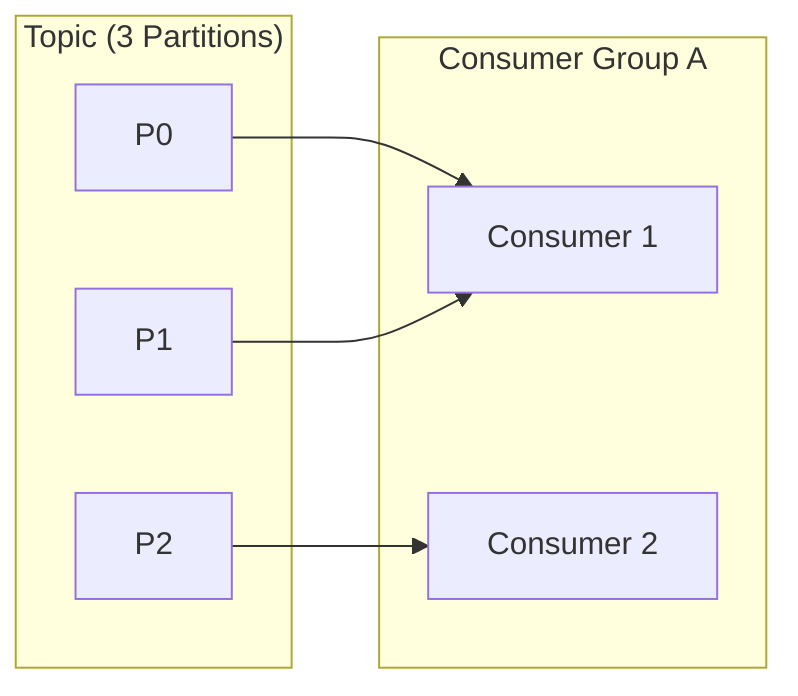

### 핵심 규칙

1. **하나의 Partition은 그룹 내 하나의 Consumer만 소비**할 수 있다
2. 하나의 Consumer는 여러 Partition을 소비할 수 있다
3. Consumer 수가 Partition 수보다 많으면 일부 Consumer는 유휴 상태가 된다

### LAG

Consumer가 얼마나 뒤처져 있는지를 나타내는 지표다.

```
LAG = LOG-END-OFFSET - CURRENT-OFFSET
```

- LAG이 지속적으로 증가하면 Consumer 처리 속도가 부족하다는 신호다
- Consumer 추가 또는 처리 로직 최적화가 필요하다

## Consumer Offset

Consumer가 어디까지 읽었는지를 추적하는 메커니즘이다.

### __consumer_offsets 토픽

Kafka는 Consumer Offset을 내부 토픽 `__consumer_offsets`에 저장한다.

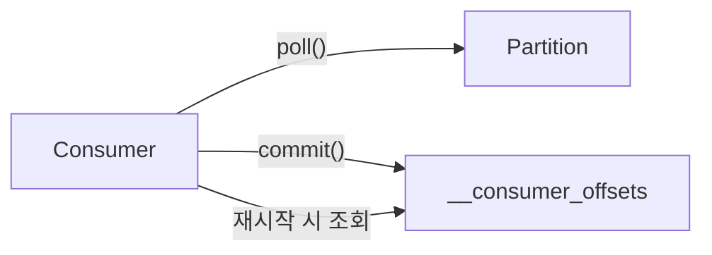

- Consumer Group별, Partition별로 마지막 커밋된 offset을 저장
- Consumer 재시작 시 이 offset부터 다시 읽기 시작

### Offset Commit 방식

| 설정 | 값 | 동작 |
|------|-----|------|
| `enable.auto.commit` | `true` | 주기적으로 자동 커밋 (기본 5초) |
| `enable.auto.commit` | `false` | 수동 커밋 (commitSync/commitAsync) |

**Auto Commit의 위험성**: 메시지 처리 전에 offset이 커밋되면 장애 시 메시지 유실 가능

### auto.offset.reset

Consumer Group이 처음 시작하거나 offset이 유효하지 않을 때의 동작을 결정한다.

| 값 | 동작 |
|----|------|
| `earliest` | 가장 오래된 메시지부터 읽기 |
| `latest` | 가장 최신 메시지부터 읽기 (기본값) |
| `none` | 유효한 offset이 없으면 예외 발생 |

## Consumer Rebalancing

Consumer Group 내 Partition 할당이 재조정되는 과정이다.

### Rebalancing 트리거

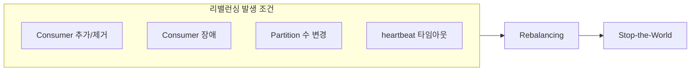

- **session.timeout.ms**: heartbeat 없이 이 시간이 지나면 Consumer가 죽은 것으로 간주 (기본 45초)
- **max.poll.interval.ms**: poll() 호출 간격이 이 시간을 넘으면 Consumer 제외 (기본 5분)

### Rebalancing 전략

| 전략 | 설명 | 특징 |
|------|------|------|
| **Eager (기본)** | 모든 Partition 할당 해제 후 재할당 | Stop-the-World 발생 |
| **Cooperative** | 변경이 필요한 Partition만 재할당 | 점진적 리밸런싱, 중단 최소화 |

```properties
# Cooperative Rebalancing 활성화
partition.assignment.strategy=org.apache.kafka.clients.consumer.CooperativeStickyAssignor
```

### Static Membership

Consumer 재시작 시 리밸런싱을 방지한다.

```properties
group.instance.id=consumer-1  # 고유 ID 지정
session.timeout.ms=300000     # 타임아웃 늘리기
```

- 같은 `group.instance.id`로 재연결하면 이전 Partition 할당 유지
- 롤링 배포 시 유용

## Broker와 Cluster

### Broker

Kafka Broker는 다음 역할을 수행한다.

- Partition에 대한 Read/Write 관리
- Topic 내 Partition들의 분산, 유지, 관리
- 각 Broker는 고유 ID(숫자)로 식별된다
- 하나의 Broker는 Topic의 일부 Partition만 가진다

### Controller

Cluster 내 하나의 Broker가 Controller 역할을 담당한다.

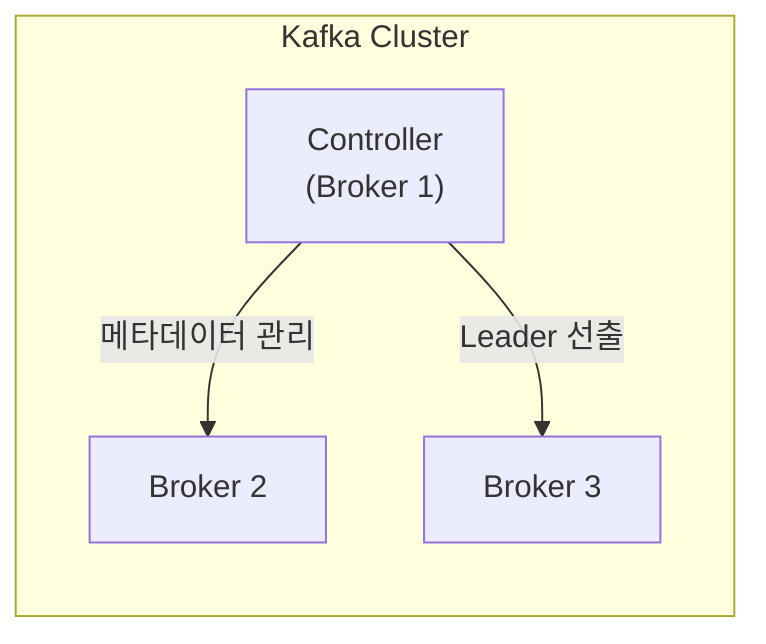

**Controller의 역할:**
- Partition Leader 선출
- Broker 추가/제거 감지
- Replica 상태 모니터링
- 메타데이터 변경 전파

Controller 장애 시 다른 Broker가 새 Controller로 선출된다.

### Cluster 구성

- 최소 3대 이상, 4대 이상 권장
- Client는 하나의 Broker에 연결하면 전체 Cluster에 연결된다

### Bootstrap Server

모든 Kafka Broker는 Bootstrap Server 역할을 한다.

- 각 Broker는 전체 Broker, Topic, Partition 메타데이터를 알고 있다
- 장애 대비를 위해 전체 Broker 목록을 연결 파라미터로 전달하는 것이 좋다

```properties
bootstrap.servers=broker1:9092,broker2:9092,broker3:9092
```

## Zookeeper와 KRaft

### Zookeeper (레거시)

Kafka 2.x까지는 Zookeeper가 필수였다.

- Broker 목록 및 설정 관리
- Topic 생성/제거, Broker 추가/제거 시 Kafka에 알림
- 홀수 서버로 구성 (최소 3, 권장 5)

### KRaft 모드 (Kafka 3.x+)

KIP-500을 통해 Zookeeper 의존성이 제거되었다.

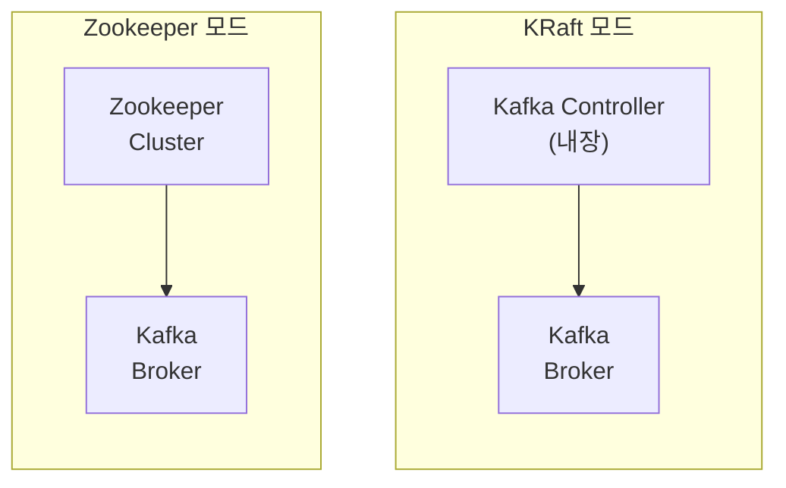

- Kafka 3.3부터 Production Ready
- Kafka 4.0에서 Zookeeper 완전 제거 예정
- 메타데이터 관리를 Kafka 자체 Raft 프로토콜로 처리

## Producer

### 메시지 전송 흐름

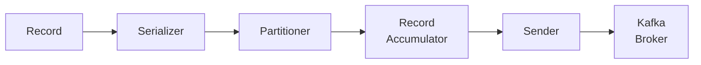

1. Record 생성 (Key, Value, Headers)
2. Serializer로 Byte Array 변환
3. Partitioner가 대상 Partition 결정
4. Record Accumulator에서 배치로 묶음
5. Sender가 Broker로 전송

### Partitioner 전략

| Key 상태 | 동작 |
|----------|------|
| Key 있음 | Key의 해시값으로 Partition 결정 (같은 Key = 같은 Partition) |
| Key 없음 | Round-Robin 또는 Sticky Partitioner |

커스텀 Partitioner를 구현하여 교체할 수 있다.

### Message Compression

Producer에서 메시지를 압축하여 전송할 수 있다.

| 압축 방식 | 압축률 | CPU 사용량 | 특징 |
|----------|--------|-----------|------|
| `none` | - | - | 압축 안 함 (기본값) |
| `gzip` | 높음 | 높음 | 최고 압축률 |
| `snappy` | 중간 | 낮음 | 균형 잡힌 선택 |
| `lz4` | 중간 | 매우 낮음 | 빠른 압축/해제 |
| `zstd` | 높음 | 중간 | gzip보다 빠르고 압축률 유사 |

```properties
compression.type=lz4
```

- Broker에서 압축된 상태로 저장
- Consumer가 자동으로 해제

### Producer Acks

메시지 전송 신뢰성과 성능의 트레이드오프다.

| acks | 동작 | 신뢰성 | 성능 |
|------|------|--------|------|
| `0` | 응답 기다리지 않음 | 낮음 | 높음 |
| `1` | Leader만 확인 | 중간 | 중간 |
| `all` | 모든 ISR 확인 | 높음 | 낮음 |

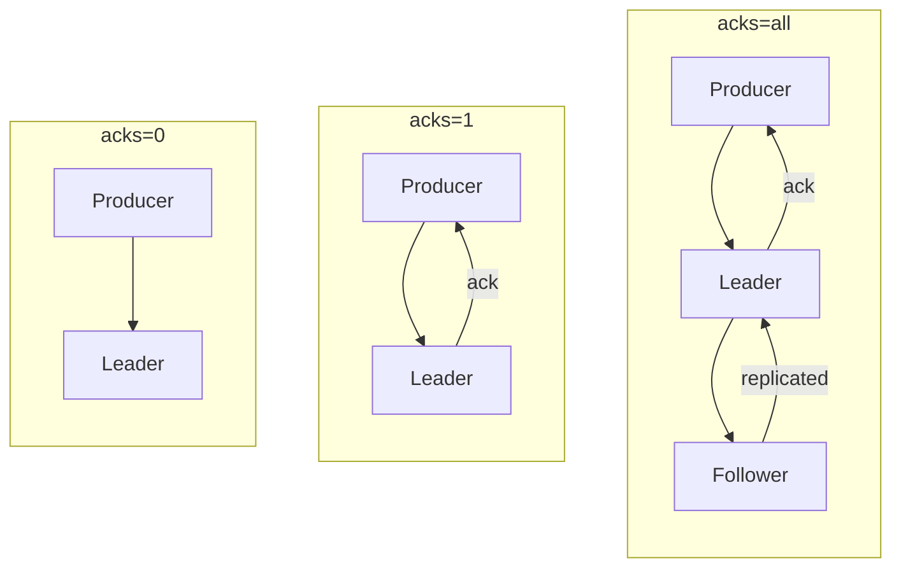

**주의**: `acks=1`일 때 Leader가 ack를 보낸 후 Follower가 복제하기 전에 Leader가 죽으면 데이터가 손실될 수 있다.

## Message Delivery Semantics

메시지 전달 보장 수준을 정의한다.

| 방식 | 설명 | 발생 조건 |
|------|------|----------|
| **At-most-once** | 최대 한 번 전달 (유실 가능) | acks=0, auto commit |
| **At-least-once** | 최소 한 번 전달 (중복 가능) | acks=all, 수동 commit |
| **Exactly-once** | 정확히 한 번 전달 | Idempotent + Transaction |

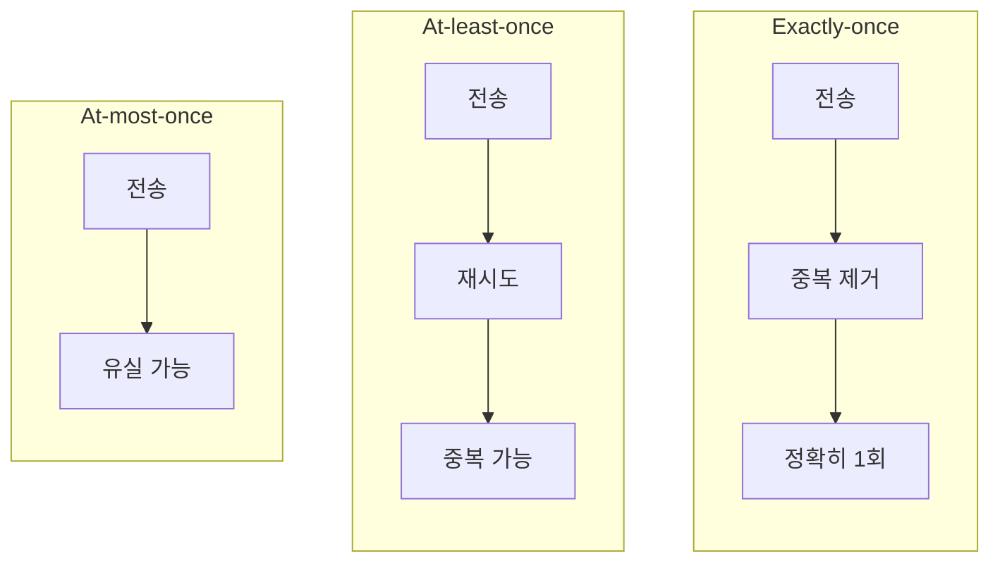

### 선택 가이드

| 요구사항 | 권장 방식 |
|----------|----------|
| 로그, 메트릭 (유실 허용) | At-most-once |
| 일반 이벤트 처리 | At-least-once + 멱등 처리 |
| 금융, 결제 (중복 불가) | Exactly-once |

## Idempotent Producer

Producer 재시도로 인한 메시지 중복을 방지한다.

```properties
enable.idempotence=true  # Kafka 3.0+에서 기본값
```

### 동작 원리

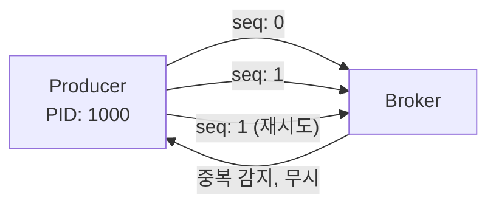

- **Producer ID (PID)**: 각 Producer 인스턴스의 고유 ID
- **Sequence Number**: 메시지별 순차 번호
- Broker는 (PID, Partition, SeqNum) 조합으로 중복 감지

### 제한사항

- 단일 Partition 내에서만 중복 방지
- Producer 재시작 시 새 PID 할당 → 재시작 전후 중복 가능
- 여러 Partition에 걸친 원자적 쓰기는 Transaction 필요

## Kafka Transaction

여러 Partition에 걸친 원자적 쓰기와 Exactly-Once Semantics를 제공한다.

### Producer Transaction

```java
producer.initTransactions();
try {
    producer.beginTransaction();
    producer.send(record1);
    producer.send(record2);
    producer.commitTransaction();
} catch (Exception e) {
    producer.abortTransaction();
}
```

```properties
transactional.id=my-transactional-id  # 필수 설정
enable.idempotence=true               # 자동 활성화
```

### Consumer의 Transaction 격리 수준

```properties
isolation.level=read_committed  # 커밋된 메시지만 읽음
# isolation.level=read_uncommitted  # 모든 메시지 읽음 (기본값)
```

### Consume-Transform-Produce 패턴

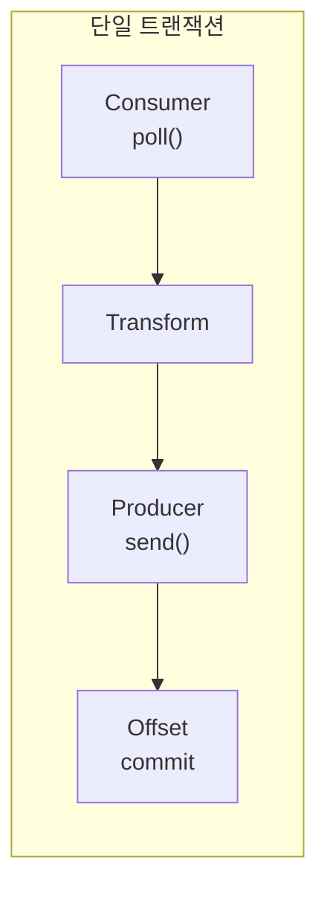

- 메시지 소비, 처리, 발행, offset 커밋을 하나의 트랜잭션으로 묶음
- 전부 성공하거나 전부 실패

## Replication

고가용성을 위해 Partition은 여러 Broker에 복제된다.

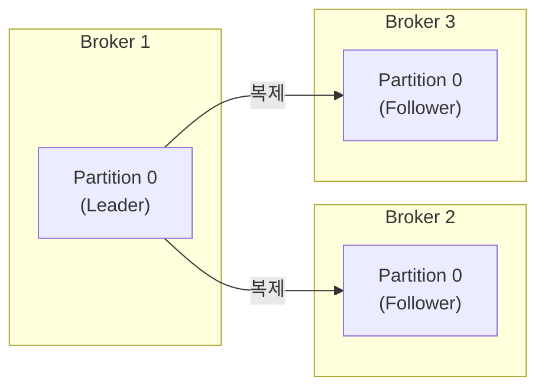

### Leader와 Follower

- **Leader**: 모든 Read/Write 요청을 처리
- **Follower**: Leader의 데이터를 복제, Leader 장애 시 승격 가능

### Replication Factor

```properties
# Topic 생성 시 지정
replication.factor=3
```

- RF=3이면 원본 + 2개 복제본
- Broker 수 이하로 설정해야 한다
- 중요 데이터는 RF=3 이상 권장

### Leader 재분배

```properties
auto.leader.rebalance.enable=true          # 자동 리밸런싱 활성화
leader.imbalance.check.interval.seconds=300 # 체크 주기
leader.imbalance.per.broker.percentage=10   # 불균형 임계치
```

## ISR (In-Sync Replica)

ISR은 Leader와 동기화된 Replica 집합이다.

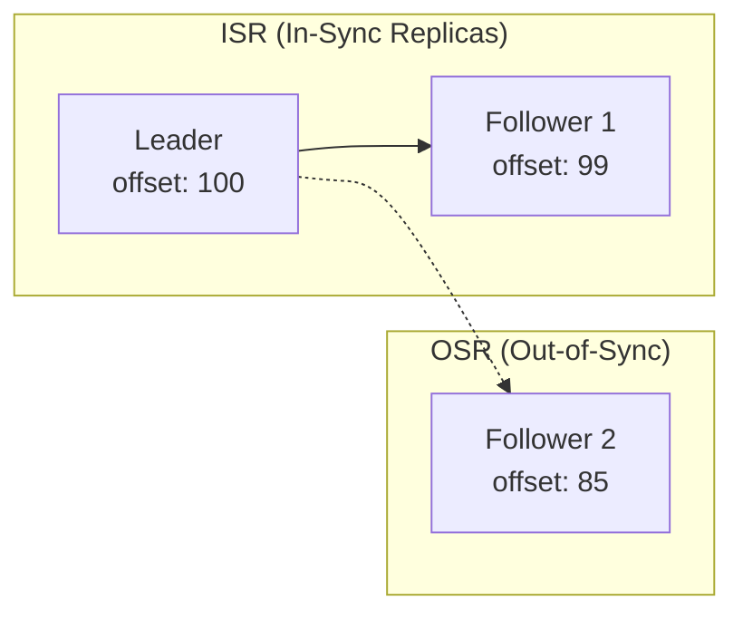

### ISR 관리

| 설정 | 설명 | 기본값 |
|------|------|--------|
| `replica.lag.time.max.ms` | Follower가 이 시간 내에 fetch하지 않으면 ISR에서 제외 | 30000 |
| `min.insync.replicas` | acks=all 시 필요한 최소 ISR 수 | 1 |

### Leader 선출

Leader 장애 시 ISR 중에서 새 Leader가 선출된다.

- ISR에 있는 Replica만 Leader 후보가 될 수 있다
- OSR에서 Leader를 선출하면 데이터 손실 가능성이 있다
- `unclean.leader.election.enable=false` (기본값)로 OSR 선출을 방지한다

## High Watermark와 LEO

복제 메커니즘의 핵심 개념이다.

### LEO (Log End Offset)

각 Replica가 가진 마지막 메시지의 다음 offset이다.

### High Watermark (HW)

Consumer가 읽을 수 있는 마지막 offset이다. 모든 ISR이 복제 완료한 지점을 의미한다.

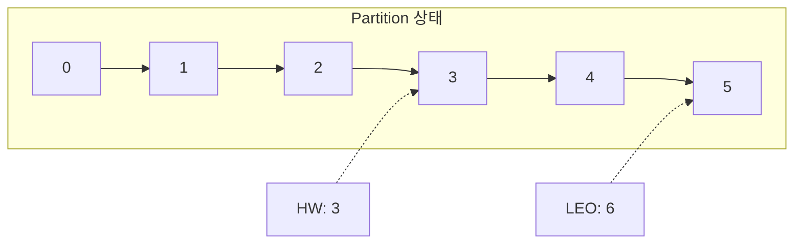

| 개념 | 설명 |
|------|------|
| **LEO** | Leader가 받은 마지막 메시지 + 1 |
| **HW** | 모든 ISR이 복제 완료한 지점 |
| **Consumer 가시성** | HW 이전 메시지만 읽기 가능 |

### HW 업데이트 흐름

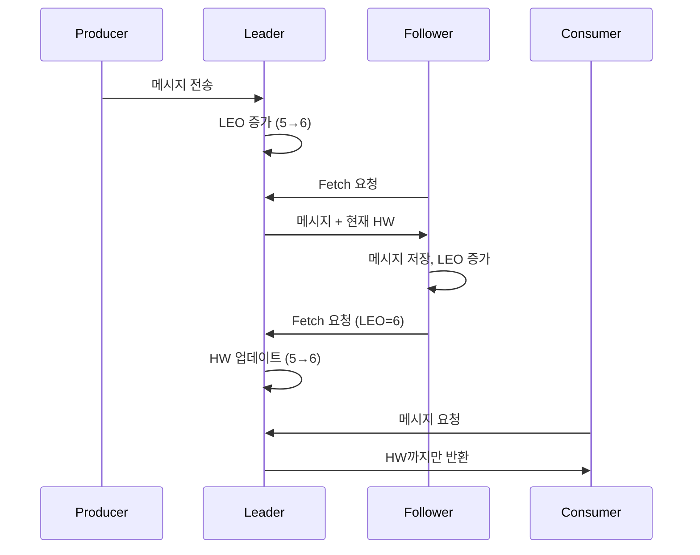

### 왜 HW가 필요한가?

- Leader 장애 시 새 Leader(Follower)는 HW까지만 데이터 보장
- HW 이후 메시지는 유실될 수 있으므로 Consumer에게 노출하지 않음
- **데이터 일관성 보장**의 핵심 메커니즘

## 데이터 보존 정책

### 시간 기반 보존

```properties
log.retention.hours=168      # 7일 (기본값)
log.retention.minutes=10080  # 분 단위
log.retention.ms=604800000   # 밀리초 단위
```

### 크기 기반 보존

```properties
log.retention.bytes=1073741824  # Partition당 최대 1GB
```

### Compaction

Key 기반으로 최신 값만 유지하는 전략이다.

```properties
log.cleanup.policy=compact
```

- 같은 Key의 이전 레코드는 삭제된다
- 상태 저장소(State Store) 용도에 적합하다

## 정리

| 개념 | 핵심 포인트 |
|------|-------------|
| Topic/Partition | Topic은 논리적, Partition은 물리적. Partition 수 = 최대 병렬 처리 수 |
| Consumer Group | Partition:Consumer = N:1 관계. LAG 모니터링 필수 |
| Consumer Offset | `__consumer_offsets`에 저장. auto commit 주의 |
| Rebalancing | Consumer 변경 시 발생. Cooperative 전략으로 영향 최소화 |
| Broker/Cluster | 최소 3대, 4대 이상 권장. Controller가 메타데이터 관리 |
| Replication | RF=3 권장. Leader만 Read/Write 처리 |
| ISR | 동기화된 Replica. Leader 선출의 후보군 |
| High Watermark | Consumer가 읽을 수 있는 마지막 offset. 일관성 보장 |
| Producer Acks | 0/1/all 트레이드오프. 중요 데이터는 all 권장 |
| Delivery Semantics | At-most/At-least/Exactly-once. 요구사항에 맞게 선택 |
| Idempotent Producer | 중복 방지. Kafka 3.0+에서 기본 활성화 |
| Transaction | 여러 Partition 원자적 쓰기. Exactly-once 구현 |

## 참고 자료

- [Apache Kafka Documentation](https://kafka.apache.org/documentation/)
- [Kafka: The Definitive Guide](https://www.confluent.io/resources/kafka-the-definitive-guide/)
- [KIP-500: Replace ZooKeeper with a Self-Managed Metadata Quorum](https://cwiki.apache.org/confluence/display/KAFKA/KIP-500%3A+Replace+ZooKeeper+with+a+Self-Managed+Metadata+Quorum)
- [Exactly-Once Semantics in Kafka](https://www.confluent.io/blog/exactly-once-semantics-are-possible-heres-how-apache-kafka-does-it/)
