## 개요

Spring Framework는 Java 엔터프라이즈 애플리케이션 개발의 표준이다. 이 글에서는 Spring의 핵심 개념들을 정리한다.

---

## Spring MVC

### Front Controller 패턴

Spring MVC는 Front Controller 패턴을 사용한다. 모든 요청이 단일 진입점(DispatcherServlet)을 통해 처리된다.

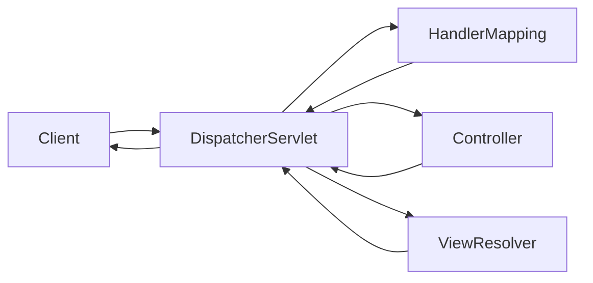

### DispatcherServlet 동작 흐름

1. **HandlerMapping**: 요청 URL에 맞는 Controller를 찾는다
2. **HandlerAdapter**: Controller의 메서드를 실행한다
3. **ViewResolver**: 논리적 View 이름을 실제 View로 변환한다

| 컴포넌트 | 역할 |
|----------|------|
| HandlerMapping | URL → Controller 매핑 |
| HandlerAdapter | Controller 메서드 실행 |
| ViewResolver | View 이름 → 실제 View 변환 |
| HandlerExceptionResolver | 예외 처리 |

### @Controller vs @RestController

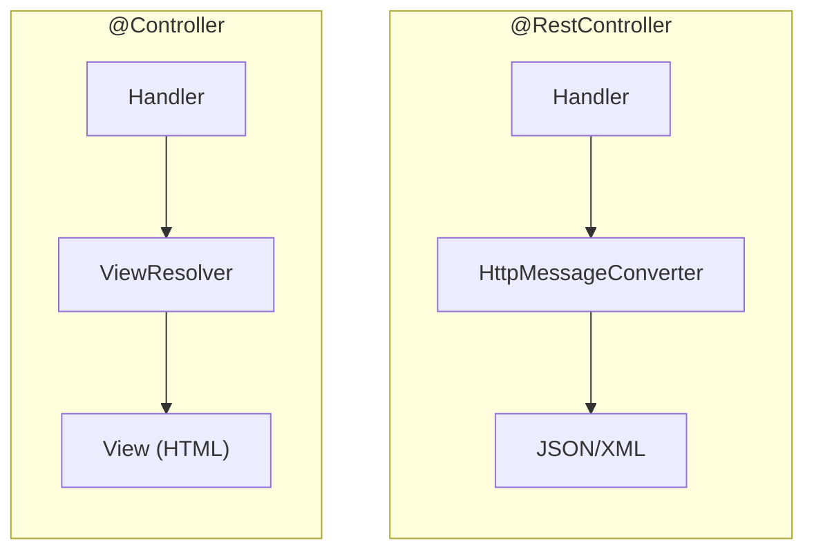

| 구분 | @Controller | @RestController |
|------|-------------|-----------------|
| 반환 | View 이름 | 데이터 (JSON/XML) |
| 변환 | ViewResolver | HttpMessageConverter |
| 용도 | SSR (Server Side Rendering) | REST API |
| @ResponseBody | 필요 | 내장 |

`@RestController` = `@Controller` + `@ResponseBody`

---

## DI / IoC

### IoC (Inversion of Control)

**제어의 역전**은 프로그램의 제어 흐름을 직접 제어하는 것이 아니라 외부에서 관리하는 것을 의미한다.

### DI (Dependency Injection)

**의존성 주입**은 객체를 직접 생성하는 게 아니라 외부에서 생성한 후 주입 시켜주는 방식이다. DI를 통해 모듈 간 **결합도가 낮아지고 유연성이 높아진다**.

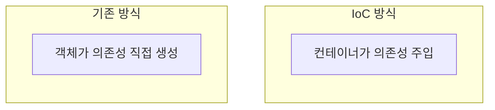

### IoC 컨테이너 (ApplicationContext)

IoC 컨테이너는 애플리케이션 실행 시점에 Bean을 인스턴스화하고 DI한 후 애플리케이션을 기동한다.

| 어노테이션 | 역할 |
|-----------|------|
| `@Configuration` | 구성 정보를 담당하는 클래스에 선언 |
| `@Bean` | 메서드 반환 객체를 스프링 컨테이너에 등록 |

```java
@Configuration
public class AppConfig {
    @Bean
    public OrderService orderService() {
        return new OrderService(orderRepository());
    }

    @Bean
    public OrderRepository orderRepository() {
        return new OrderRepositoryImpl();
    }
}

// Bean 조회
ApplicationContext ctx = new AnnotationConfigApplicationContext(AppConfig.class);
OrderService service = ctx.getBean(OrderService.class);
```

### 의존성 주입 방식

| 방식 | 특징 | 권장 여부 |
|------|------|----------|
| 생성자 주입 | 불변성 보장, 필수 의존성 | ✅ 권장 |
| Setter 주입 | 선택적 의존성, 변경 가능 | 선택적 사용 |
| 필드 주입 | 테스트 어려움, 순환 참조 숨김 | ❌ 비권장 |

**생성자 주입**
- 생성자 호출 시점에 **딱 1번만** 호출되는 것을 보장
- **불변, 필수** 의존관계에 사용

**Setter 주입**
- **선택, 변경 가능성**이 있는 의존관계에 사용
- 스프링 빈을 선택적으로 등록 가능

**필드 주입**
- `@Autowired`를 사용하지만 외부에서 변경 불가능하여 테스트 어려움
- DI 프레임워크 없이 작동 불가
- 테스트 코드나 `@Configuration`에서만 제한적 사용

**생성자 주입이 권장되는 이유**
- 불변성(immutability) 보장
- 순환 참조를 컴파일 타임에 발견
- 테스트 시 Mock 주입 용이
- `final` 키워드로 누락 방지

```java
@Service
public class OrderService {
    private final OrderRepository repository;

    // 생성자 주입 (단일 생성자면 @Autowired 생략 가능)
    public OrderService(OrderRepository repository) {
        this.repository = repository;
    }
}
```

---

## Spring Bean

### Bean이란?

Spring IoC 컨테이너가 관리하는 객체를 Bean이라 한다. 기본적으로 싱글톤으로 관리된다.

### Bean 등록 방법

| 어노테이션 | 용도 |
|-----------|------|
| `@Component` | 일반 컴포넌트 |
| `@Service` | 비즈니스 로직 |
| `@Repository` | 데이터 접근 계층 |
| `@Controller` | 웹 컨트롤러 |
| `@Configuration` + `@Bean` | 수동 Bean 등록 |

### @Bean vs @Component

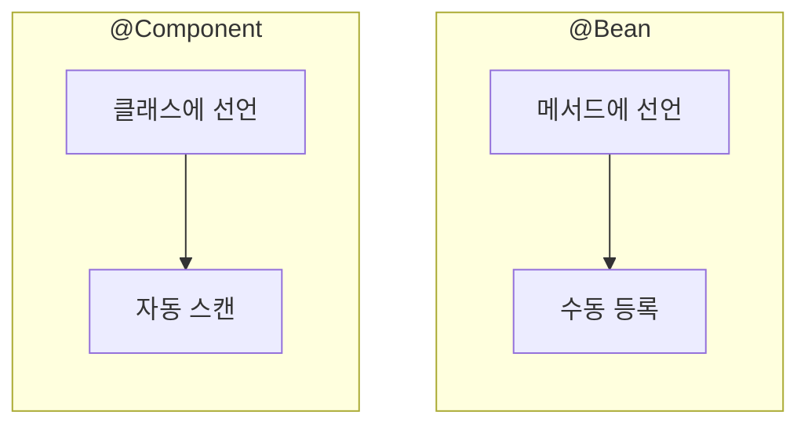

| 구분 | @Component | @Bean |
|------|------------|-------|
| 선언 위치 | 클래스 | 메서드 |
| 사용 시점 | 직접 만든 클래스 | 외부 라이브러리 |
| 등록 방식 | 컴포넌트 스캔 | 수동 등록 |

```java
@Configuration
public class AppConfig {
    @Bean  // 외부 라이브러리 객체를 Bean으로 등록
    public ObjectMapper objectMapper() {
        return new ObjectMapper();
    }
}
```

### Bean Scope

| Scope | 설명 |
|-------|------|
| singleton | 기본값. 컨테이너당 하나의 인스턴스 |
| prototype | 요청마다 새 인스턴스 생성 |
| request | HTTP 요청마다 새 인스턴스 (웹) |
| session | HTTP 세션마다 새 인스턴스 (웹) |

### 싱글톤 + 프로토타입 스코프 문제

**문제**: 싱글톤 Bean이 프로토타입 Bean을 주입받으면, 프로토타입이 싱글톤처럼 동작한다.

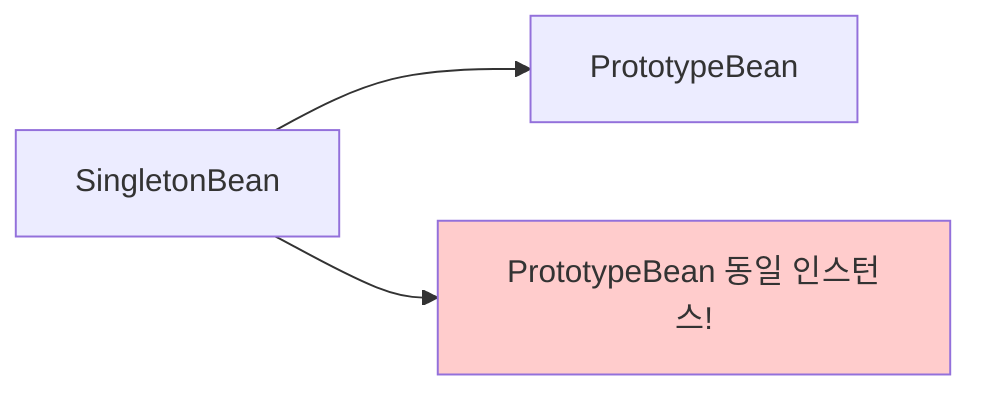

싱글톤 생성 시점에 프로토타입이 주입되어 고정되기 때문이다.

**해결 방법**

| 방법 | 설명 |
|------|------|
| ObjectProvider | `provider.getObject()` 호출 시마다 새 인스턴스 |
| JSR-330 Provider | 자바 표준, 단위 테스트 용이 |
| 프록시 사용 | CGLIB 프록시가 실제 Bean 요청 위임 |

```java
@Service
public class SingletonService {
    private final ObjectProvider<PrototypeBean> provider;

    public void logic() {
        PrototypeBean proto = provider.getObject();  // 매번 새 인스턴스
    }
}
```

### Bean 생명주기

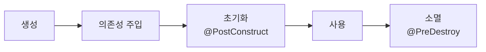

**생명주기 콜백 3가지 방법**

| 방법 | 초기화 | 소멸 | 특징 |
|------|--------|------|------|
| 인터페이스 | `InitializingBean.afterPropertiesSet()` | `DisposableBean.destroy()` | 스프링 의존 |
| 어노테이션 | `@PostConstruct` | `@PreDestroy` | ✅ 권장 |
| @Bean 속성 | `@Bean(initMethod="init")` | `@Bean(destroyMethod="close")` | 외부 라이브러리용 |

```java
@Component
public class ConnectionPool {
    @PostConstruct
    public void init() {
        // 의존성 주입 완료 후 호출
    }

    @PreDestroy
    public void close() {
        // 스프링 컨테이너 종료 전 호출
    }
}
```

---

## Autowiring

컨테이너가 타입(인터페이스 또는 클래스)을 기준으로 의존 대상을 찾아 자동 주입한다.

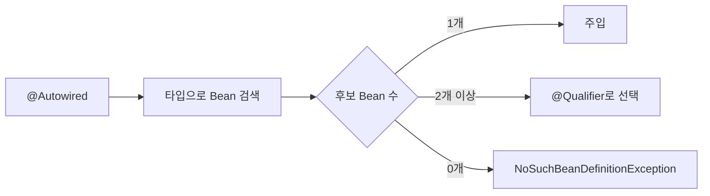

| 상황 | 동작 |
|------|------|
| 타입 일치 Bean 1개 | 자동 주입 |
| 타입 일치 Bean 2개 이상 | `@Qualifier`로 지정 필요 |
| 타입 일치 Bean 없음 | 예외 발생 (`required=false`로 회피 가능) |

---

## Application 구동 시 메서드 실행

Spring Application 시작 시점에 특정 로직을 실행하는 방법이다.

| 방법 | 설명 |
|------|------|
| `CommandLineRunner` | `run(String... args)` 구현, CLI 인자 접근 |
| `ApplicationRunner` | `run(ApplicationArguments args)` 구현 |
| `@PostConstruct` | Bean 초기화 직후 실행 |
| `InitializingBean` | `afterPropertiesSet()` 구현 |
| `@Bean(initMethod)` | 지정한 메서드 호출 |
| `ApplicationEvent` | `ApplicationReadyEvent` 리스너 등록 |

```java
@Component
public class StartupRunner implements CommandLineRunner {
    @Override
    public void run(String... args) {
        // 애플리케이션 시작 시 실행
    }
}

// 또는 @EventListener 사용
@EventListener(ApplicationReadyEvent.class)
public void onReady() {
    // 모든 Bean 초기화 완료 후 실행
}
```

---

## Filter vs Interceptor

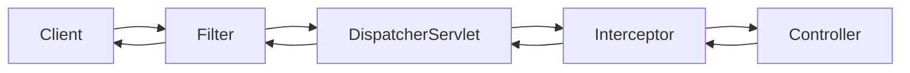

| 구분 | Filter | Interceptor |
|------|--------|-------------|
| 관리 주체 | Servlet Container | Spring Container |
| 실행 위치 | DispatcherServlet 앞 | DispatcherServlet 뒤 |
| 접근 범위 | ServletRequest/Response | HttpServletRequest, Handler |
| 용도 | 인코딩, 인증/인가(Spring Security), CORS | 로깅, API 호출 기록, 공통 처리 |
| Spring Bean | @Component 필요 | HandlerInterceptor 구현 |

**Filter 사용 예시**: 인코딩, Spring Security(인증/인가), XSS 필터링, CORS
**Interceptor 사용 예시**: API 호출 로깅, 실행 시간 측정, 공통 헤더 처리

### 예외 처리 차이

| 구분 | Filter | Interceptor |
|------|--------|-------------|
| 예외 발생 시 | `ErrorController`에서 처리 | `@ControllerAdvice`로 처리 가능 |
| 이유 | DispatcherServlet 외부 | DispatcherServlet 내부 |

Filter는 DispatcherServlet 외부에 존재하기 때문에 예외가 발생하면 `ErrorController`에서 처리해야 한다. 반면 Interceptor는 DispatcherServlet 내부에 존재하기 때문에 `@ControllerAdvice`를 적용할 수 있다.

---

## AOP (Aspect-Oriented Programming)

### 개념

AOP는 횡단 관심사(cross-cutting concerns)를 분리하는 프로그래밍 패러다임이다. 로깅, 트랜잭션, 보안 등을 비즈니스 로직에서 분리한다.

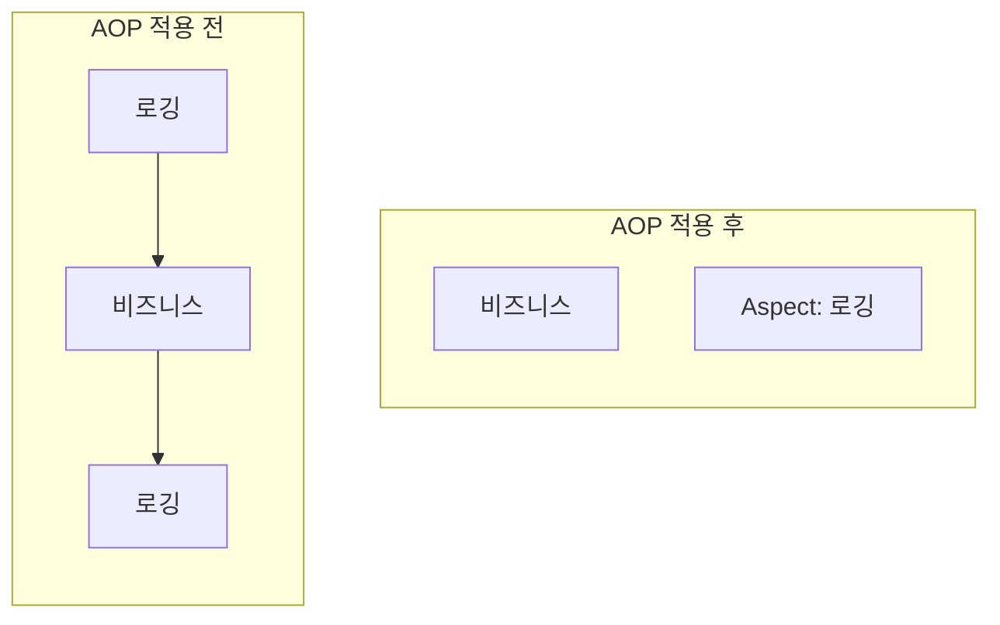

### 주요 용어

| 용어 | 설명 | 예시 |
|------|------|------|
| Aspect | 횡단 관심사 모듈 | `@Aspect` 클래스 (로깅, 트랜잭션) |
| Join Point | Advice 적용 가능 지점 | `orderService.createOrder()` 메서드 실행 |
| Pointcut | Join Point 선별 표현식 | `execution(* com.example.service.*.*(..))` |
| Advice | 실제 실행할 로직 | `@Before`, `@After`, `@Around` |
| Target | Advice 적용 대상 객체 | `OrderService` Bean |

```java
@Aspect  // Aspect: 횡단 관심사 모듈
@Component
public class LoggingAspect {

    // Pointcut: Join Point 선별 표현식
    @Pointcut("execution(* com.example.service.*.*(..))")
    public void serviceMethods() {}

    // Advice: 실제 실행 로직 (Before - 메서드 실행 전)
    @Before("serviceMethods()")
    public void logBefore(JoinPoint joinPoint) {  // JoinPoint: 메서드 실행 지점
        log.info("호출: {}", joinPoint.getSignature().getName());
    }

    // Advice: Around - 메서드 실행 전후
    @Around("serviceMethods()")
    public Object logExecutionTime(ProceedingJoinPoint pjp) throws Throwable {
        long start = System.currentTimeMillis();
        Object result = pjp.proceed();  // Target 메서드 실행
        log.info("실행 시간: {}ms", System.currentTimeMillis() - start);
        return result;
    }
}
```

**Advice 종류**

| Advice | 실행 시점 | 용도 |
|--------|----------|------|
| `@Before` | 메서드 실행 전 | 권한 체크, 로깅 |
| `@After` | 메서드 실행 후 (예외 무관) | 리소스 정리 |
| `@AfterReturning` | 정상 반환 후 | 결과 로깅 |
| `@AfterThrowing` | 예외 발생 시 | 에러 로깅, 알림 |
| `@Around` | 전후 모두 | 실행 시간 측정, 트랜잭션 |

### AOP 적용 방법

| 시점 | 방법 | 특징 |
|------|------|------|
| 컴파일 타임 | AspectJ 컴파일러 | 바이트코드 조작, 성능 좋음 |
| 로드 타임 | ClassLoader 위빙 | 클래스 로딩 시 변경 |
| 런타임 | 프록시 생성 | Spring AOP 기본 방식 |

Spring AOP는 **런타임 프록시 방식**을 사용한다.

### Spring AOP 구현 방식

| 방식 | 대상 | 특징 |
|------|------|------|
| JDK Dynamic Proxy | 인터페이스 | 리플렉션 기반, 인터페이스 필수 |
| CGLIB | 클래스 | 바이트코드 조작, 상속 기반 |

Spring Boot 2.0부터 기본값이 CGLIB이다.

**리플렉션(Reflection)**: 런타임에 클래스/메서드 메타정보를 동적으로 획득하고 코드를 호출하는 기법. JDK Dynamic Proxy가 이를 사용한다.

### Self-Invocation 문제

**같은 클래스 내부에서 메서드를 호출하면 AOP가 동작하지 않는다.** 프록시를 거치지 않고 직접 호출하기 때문이다.

```java
@Service
public class OrderService {
    public void process() {
        validate();  // ❌ AOP 미동작 (self-invocation)
    }

    @LogExecutionTime
    public void validate() { }
}
```

**해결 방법**
1. 별도 Bean으로 분리
2. `AopContext.currentProxy()` 사용
3. 자기 자신을 주입받아 호출

---

## @Transactional

### 선언적 vs 프로그래밍적 트랜잭션

| 방식 | 특징 |
|------|------|
| 선언적 (`@Transactional`) | AOP 기반, 비즈니스 로직과 분리, 권장 |
| 프로그래밍적 (`TransactionTemplate`) | 직접 제어, 세밀한 처리 가능 |

Spring은 `PlatformTransactionManager`로 JDBC, JPA, Hibernate 등 다양한 기술을 추상화한다.

### 동작 원리

`@Transactional`도 AOP 기반이다. 프록시가 트랜잭션을 시작하고 커밋/롤백한다.

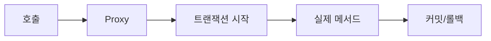

### 주의사항

| 상황 | 트랜잭션 동작 |
|------|--------------|
| public 메서드 | ✅ 동작 |
| private/protected | ❌ 미동작 |
| 같은 클래스 내부 호출 | ❌ 미동작 (self-invocation) |
| RuntimeException | 롤백 |
| Checked Exception | 커밋 (기본값) |

```java
@Transactional(rollbackFor = Exception.class)  // Checked Exception도 롤백
public void process() throws Exception { }
```

### Propagation (전파 속성)

| 속성 | 설명 |
|------|------|
| REQUIRED | 기존 트랜잭션 사용, 없으면 생성 (기본값) |
| REQUIRES_NEW | 항상 새 트랜잭션 생성 |
| NESTED | 중첩 트랜잭션 (Savepoint) |
| MANDATORY | 기존 트랜잭션 필수, 없으면 예외 |
| SUPPORTS | 트랜잭션 있으면 사용, 없어도 OK |
| NOT_SUPPORTED | 트랜잭션 없이 실행 |
| NEVER | 트랜잭션 있으면 예외 |

---

## Transaction Isolation Level

### ACID

| 속성 | 설명 |
|------|------|
| Atomicity | 전부 성공하거나 전부 실패 |
| Consistency | 트랜잭션 전후로 일관성 유지 |
| Isolation | 트랜잭션 간 격리 |
| Durability | 커밋된 데이터는 영구 저장 |

### Isolation Level

| 레벨 | Dirty Read | Non-Repeatable Read | Phantom Read |
|------|-----------|---------------------|--------------|
| READ_UNCOMMITTED | O | O | O |
| READ_COMMITTED | X | O | O |
| REPEATABLE_READ | X | X | O |
| SERIALIZABLE | X | X | X |

> PostgreSQL, Oracle 기본값: READ COMMITTED
> MySQL InnoDB 기본값: REPEATABLE READ

### 각 Isolation Level 동작

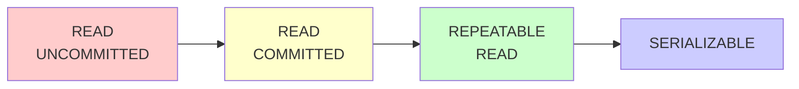

| 레벨 | 동작 | 트레이드오프 |
|------|------|-------------|
| READ UNCOMMITTED | 커밋 전 데이터도 읽음 | 정합성↓ 성능↑ |
| READ COMMITTED | 커밋된 데이터만 읽음 | 여러 스냅샷 버전 가능 |
| REPEATABLE READ | 트랜잭션 시작 시점 스냅샷 유지 | 단일 스냅샷 |
| SERIALIZABLE | 순차 실행 | 정합성↑ 동시성↓ |

### READ COMMITTED vs REPEATABLE READ

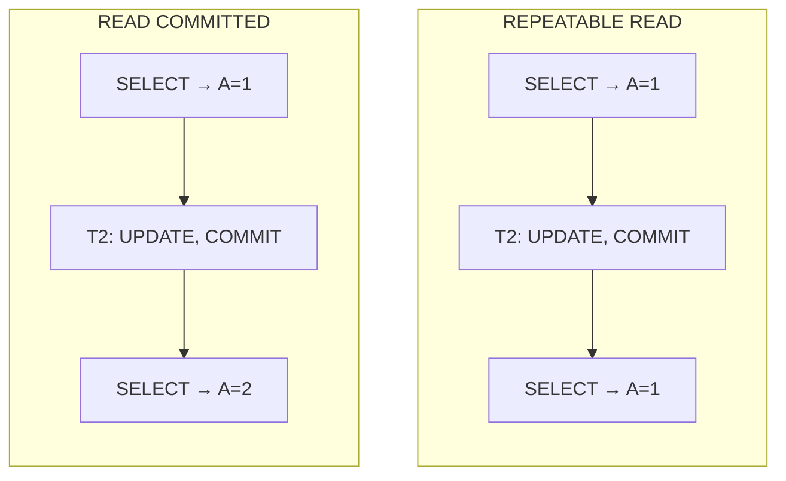

| 구분 | READ COMMITTED | REPEATABLE READ |
|------|---------------|-----------------|
| 스냅샷 | 매 쿼리마다 최신 스냅샷 | 트랜잭션 시작 시점 스냅샷 고정 |
| 같은 쿼리 2번 | 값이 다를 수 있음 | 항상 동일 |
| 사용 시점 | 최신 커밋 데이터 필요 시 | 트랜잭션 내 일관성 필요 시 |

### READ Phenomena (읽기 이상 현상)

**Dirty Read** - 커밋되지 않은 데이터를 읽는 현상

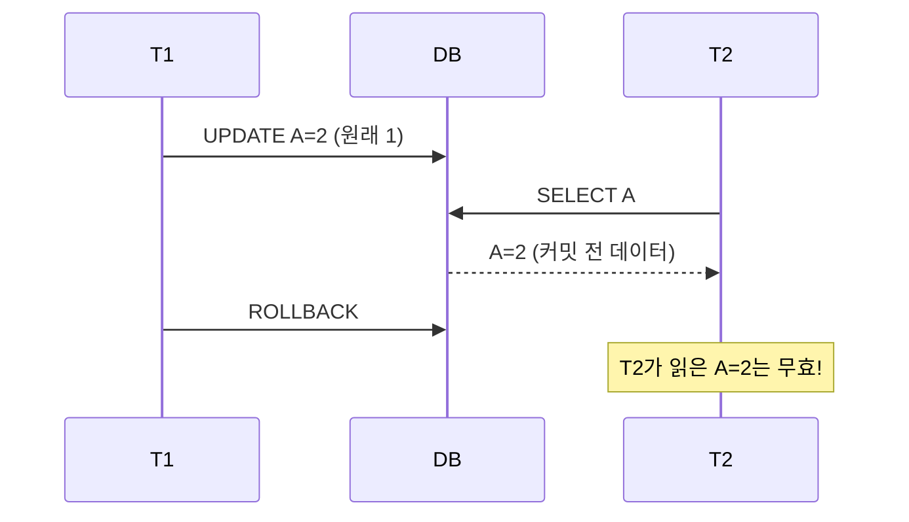

**Non-Repeatable Read** - 같은 쿼리가 다른 값을 반환하는 현상

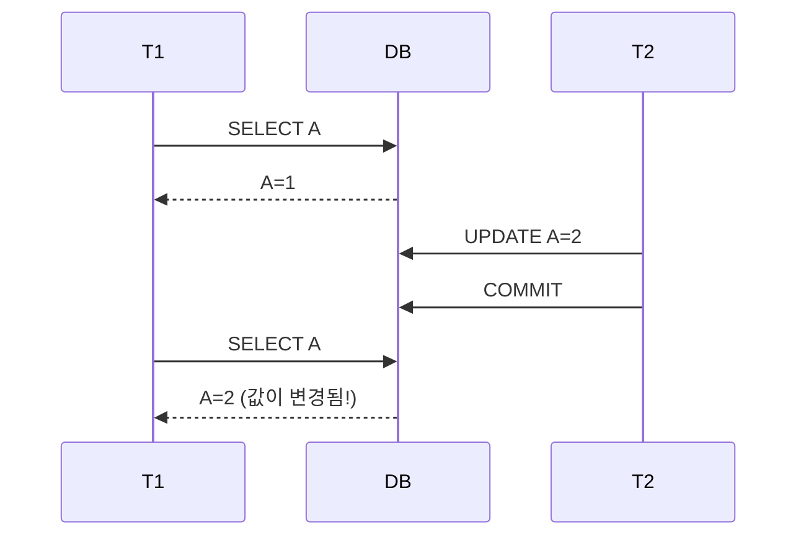

**Phantom Read** - 없던 행이 나타나는 현상

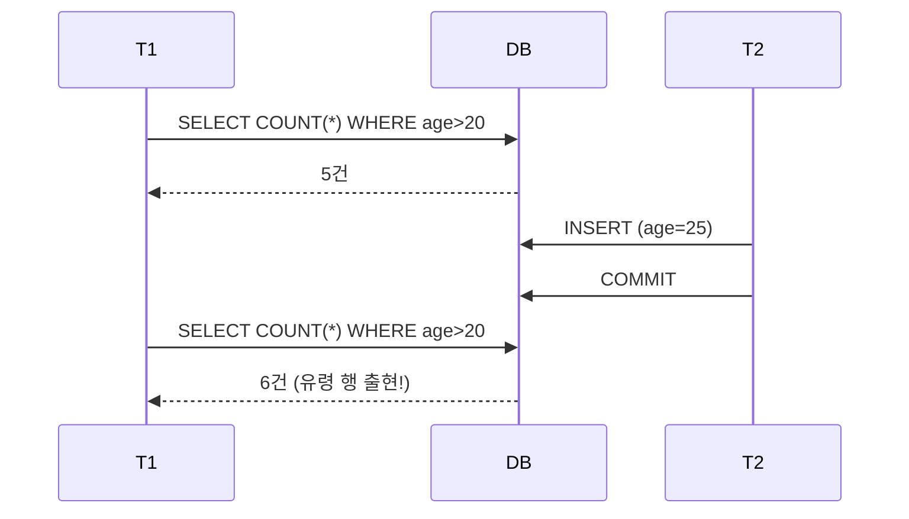

---

## CORS (Cross-Origin Resource Sharing)

브라우저의 동일 출처 정책(SOP)으로 인해 다른 도메인 요청이 차단된다. CORS로 허용할 출처를 지정한다.

### 해결 방법

```java
// 1. @CrossOrigin (Controller/메서드 단위)
@CrossOrigin(origins = "http://localhost:3000")
@RestController
public class ApiController { }

// 2. WebMvcConfigurer (전역 설정)
@Configuration
public class WebConfig implements WebMvcConfigurer {
    @Override
    public void addCorsMappings(CorsRegistry registry) {
        registry.addMapping("/api/**")
                .allowedOrigins("http://localhost:3000")
                .allowedMethods("GET", "POST");
    }
}

// 3. CorsFilter (Filter 레벨)
@Bean
public CorsFilter corsFilter() {
    CorsConfiguration config = new CorsConfiguration();
    config.addAllowedOrigin("http://localhost:3000");
    UrlBasedCorsConfigurationSource source = new UrlBasedCorsConfigurationSource();
    source.registerCorsConfiguration("/**", config);
    return new CorsFilter(source);
}
```

---

## POJO (Plain Old Java Object)

특정 프레임워크에 종속되지 않는 순수 Java 객체다. Spring은 POJO 기반 개발을 지향한다.

**POJO의 특징**
- 특정 클래스 상속 강제 없음
- 특정 인터페이스 구현 강제 없음
- 특정 어노테이션 강제 없음

```java
// POJO
public class User {
    private String name;
    public String getName() { return name; }
    public void setName(String name) { this.name = name; }
}
```

---

## 테스트 더블

| 종류 | 설명 | 사용 시점 |
|------|------|----------|
| Mock | 호출 검증용 가짜 객체 | 상호작용 검증 |
| Stub | 미리 정의된 값 반환 | 특정 상태 테스트 |
| Spy | 실제 객체 + 일부 동작 변경 | 부분 Mocking |
| Fake | 실제 구현의 단순화 버전 | In-memory DB 등 |

```java
// Mockito 예시
@Mock
private UserRepository userRepository;

@Test
void test() {
    // Stub - 반환값 지정
    when(userRepository.findById(1L)).thenReturn(Optional.of(user));

    // Mock - 호출 검증
    verify(userRepository, times(1)).save(any());
}
```

---

## 샤딩 vs 파티셔닝

데이터베이스 볼륨이 커지면 분할이 필요하다.

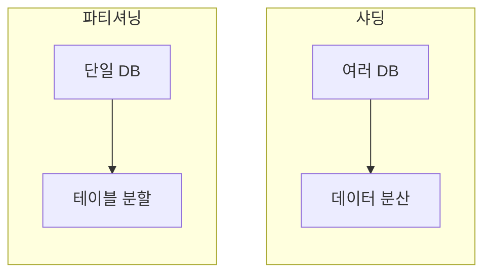

| 구분 | 파티셔닝 | 샤딩 |
|------|----------|------|
| 범위 | 단일 DB 내 테이블 분할 | 여러 DB로 데이터 분산 |
| 수평 | 행 단위 분할 | 행 단위로 DB 분산 |
| 수직 | 컬럼 단위 분할 | - |
| 복잡도 | 낮음 | 높음 (분산 트랜잭션, 조인) |

**샤딩 키 선택이 중요하다.** 데이터가 균등하게 분산되어야 한다.

---

## URL vs URI

| 구분 | 설명 | 예시 |
|------|------|------|
| URI | 리소스 식별자 (Identifier) | `/users/1` |
| URL | 리소스 위치 (Locator) | `https://api.example.com/users/1` |
| URN | 리소스 이름 (Name) | `urn:isbn:0451450523` |

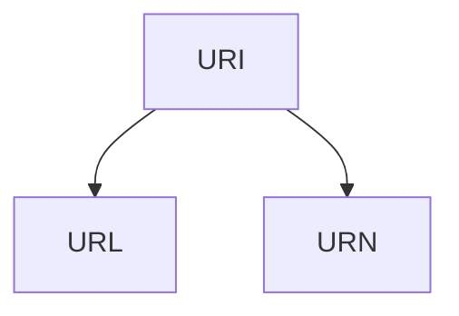

**URL ⊂ URI**: URL은 URI의 하위 개념이다. URL은 위치를 포함하고, URN은 이름만 포함한다.

---

## 정리

| 개념 | 핵심 |
|------|------|
| Spring MVC | Front Controller + DispatcherServlet |
| DI/IoC | 컨테이너가 의존성 관리 |
| Bean | Spring이 관리하는 객체 (기본 싱글톤) |
| AOP | 횡단 관심사 분리 (프록시 기반) |
| @Transactional | AOP 기반 트랜잭션 관리 |
| Filter vs Interceptor | Servlet vs Spring 레벨 |
| 샤딩 vs 파티셔닝 | 단일 DB vs 분산 DB |

---

## 참고 자료

- [Spring Framework Reference](https://docs.spring.io/spring-framework/reference/)
- [Spring MVC Documentation](https://docs.spring.io/spring-framework/reference/web/webmvc.html)
- [Transaction Management](https://docs.spring.io/spring-framework/reference/data-access/transaction.html)
