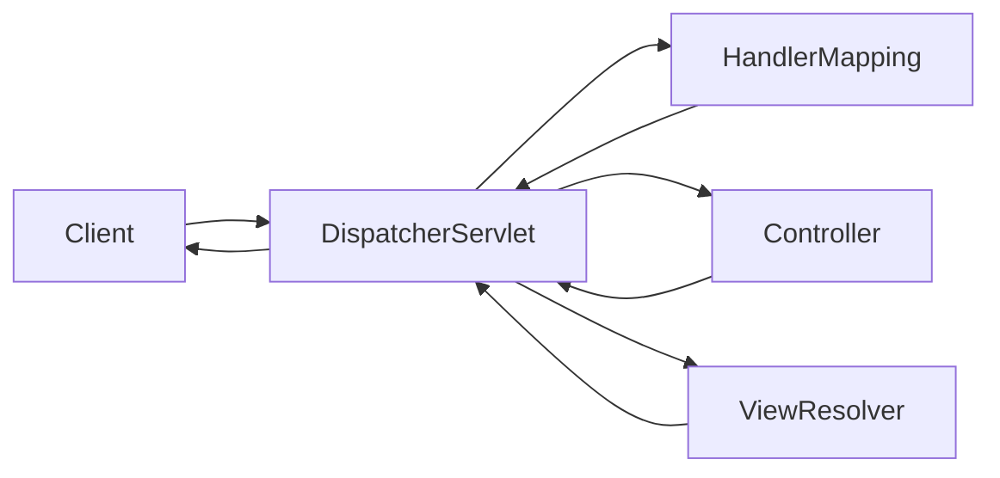
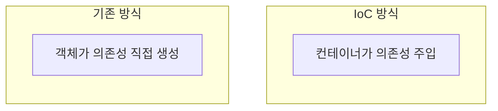
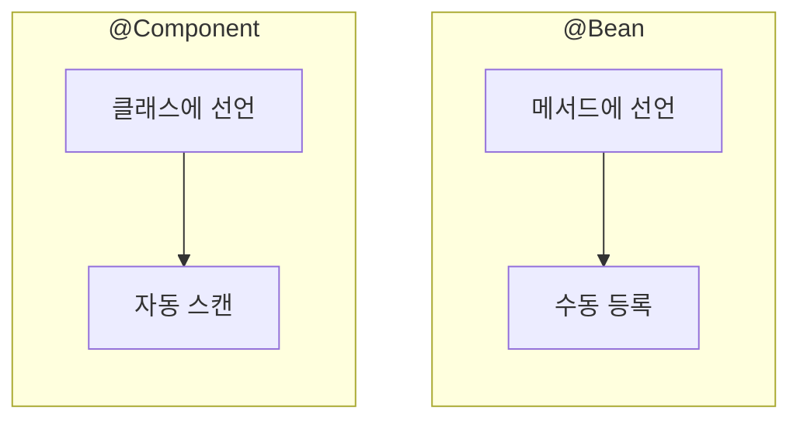
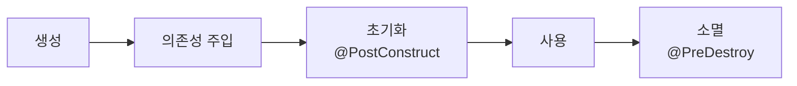
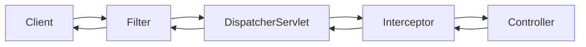
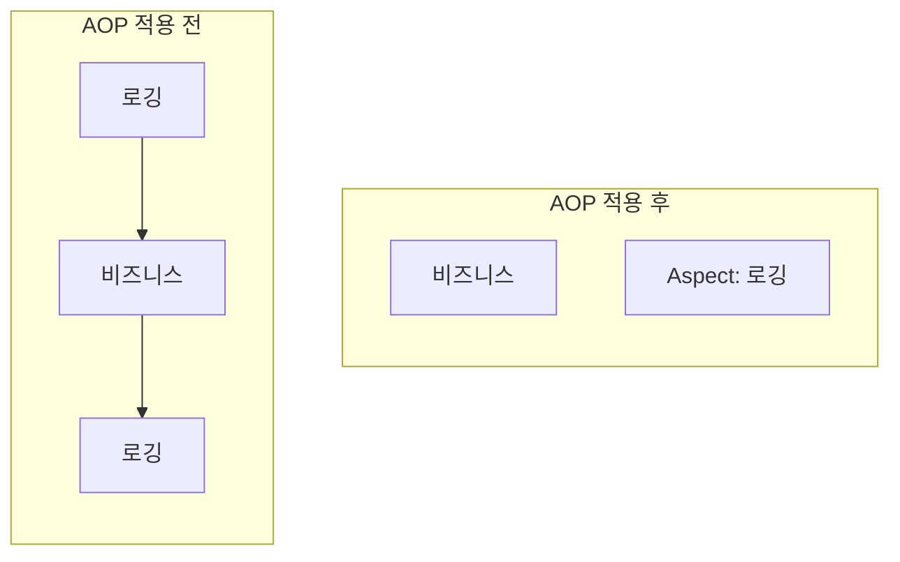
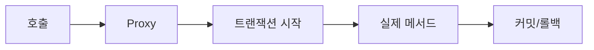

## 개요

Spring Framework는 Java 엔터프라이즈 애플리케이션 개발의 표준이다. 이 글에서는 Spring의 핵심 개념들을 정리한다.

---

## Spring MVC

### Front Controller 패턴

Spring MVC는 Front Controller 패턴을 사용한다. 모든 요청이 단일 진입점(DispatcherServlet)을 통해 처리된다.



### DispatcherServlet 동작 흐름

1. **HandlerMapping**: 요청 URL에 맞는 Controller를 찾는다
2. **HandlerAdapter**: Controller의 메서드를 실행한다
3. **ViewResolver**: 논리적 View 이름을 실제 View로 변환한다

| 컴포넌트 | 역할 |
|----------|------|
| HandlerMapping | URL → Controller 매핑 |
| HandlerAdapter | Controller 메서드 실행 |
| ViewResolver | View 이름 → 실제 View 변환 |
| HandlerExceptionResolver | 예외 처리 |

---

## DI (Dependency Injection)

### IoC (Inversion of Control)

객체의 생성과 의존성 관리를 개발자가 아닌 컨테이너가 담당한다. 제어의 역전이라 부르는 이유다.



### 의존성 주입 방식

| 방식 | 특징 | 권장 여부 |
|------|------|----------|
| 생성자 주입 | 불변성 보장, 필수 의존성 | ✅ 권장 |
| Setter 주입 | 선택적 의존성, 변경 가능 | 선택적 사용 |
| 필드 주입 | 테스트 어려움, 순환 참조 숨김 | ❌ 비권장 |

**생성자 주입이 권장되는 이유**
- 불변성(immutability) 보장
- 순환 참조를 컴파일 타임에 발견
- 테스트 시 Mock 주입 용이

```java
@Service
public class OrderService {
    private final OrderRepository repository;

    // 생성자 주입 (단일 생성자면 @Autowired 생략 가능)
    public OrderService(OrderRepository repository) {
        this.repository = repository;
    }
}
```

---

## Spring Bean

### Bean이란?

Spring IoC 컨테이너가 관리하는 객체를 Bean이라 한다. 기본적으로 싱글톤으로 관리된다.

### Bean 등록 방법

| 어노테이션 | 용도 |
|-----------|------|
| `@Component` | 일반 컴포넌트 |
| `@Service` | 비즈니스 로직 |
| `@Repository` | 데이터 접근 계층 |
| `@Controller` | 웹 컨트롤러 |
| `@Configuration` + `@Bean` | 수동 Bean 등록 |

### @Bean vs @Component



| 구분 | @Component | @Bean |
|------|------------|-------|
| 선언 위치 | 클래스 | 메서드 |
| 사용 시점 | 직접 만든 클래스 | 외부 라이브러리 |
| 등록 방식 | 컴포넌트 스캔 | 수동 등록 |

```java
@Configuration
public class AppConfig {
    @Bean  // 외부 라이브러리 객체를 Bean으로 등록
    public ObjectMapper objectMapper() {
        return new ObjectMapper();
    }
}
```

### Bean Scope

| Scope | 설명 |
|-------|------|
| singleton | 기본값. 컨테이너당 하나의 인스턴스 |
| prototype | 요청마다 새 인스턴스 생성 |
| request | HTTP 요청마다 새 인스턴스 (웹) |
| session | HTTP 세션마다 새 인스턴스 (웹) |

### Bean 생명주기



---

## Filter vs Interceptor



| 구분 | Filter | Interceptor |
|------|--------|-------------|
| 관리 주체 | Servlet Container | Spring Container |
| 실행 위치 | DispatcherServlet 앞 | DispatcherServlet 뒤 |
| 접근 범위 | ServletRequest/Response | HttpServletRequest, Handler |
| 용도 | 인코딩, 보안, 로깅 | 인증/인가, 로깅, 공통 처리 |
| Spring Bean | @Component 필요 | HandlerInterceptor 구현 |

**Filter 사용 예시**: 인코딩, XSS 필터링, CORS
**Interceptor 사용 예시**: 로그인 체크, 권한 검사, 로깅

---

## AOP (Aspect-Oriented Programming)

### 개념

AOP는 횡단 관심사(cross-cutting concerns)를 분리하는 프로그래밍 패러다임이다. 로깅, 트랜잭션, 보안 등을 비즈니스 로직에서 분리한다.



### 주요 용어

| 용어 | 설명 |
|------|------|
| Aspect | 횡단 관심사 모듈 (로깅, 트랜잭션 등) |
| Join Point | Advice가 적용될 수 있는 지점 (메서드 실행) |
| Pointcut | Join Point를 선별하는 표현식 |
| Advice | 실제 실행할 로직 (Before, After, Around) |
| Target | Advice가 적용되는 대상 객체 |

### Spring AOP 구현 방식

| 방식 | 대상 | 특징 |
|------|------|------|
| JDK Dynamic Proxy | 인터페이스 | 인터페이스 필수 |
| CGLIB | 클래스 | 상속 기반, final 불가 |

Spring Boot 2.0부터 기본값이 CGLIB이다.

### Self-Invocation 문제

**같은 클래스 내부에서 메서드를 호출하면 AOP가 동작하지 않는다.** 프록시를 거치지 않고 직접 호출하기 때문이다.

```java
@Service
public class OrderService {
    public void process() {
        validate();  // ❌ AOP 미동작 (self-invocation)
    }

    @LogExecutionTime
    public void validate() { }
}
```

**해결 방법**
1. 별도 Bean으로 분리
2. `AopContext.currentProxy()` 사용
3. 자기 자신을 주입받아 호출

---

## @Transactional

### 동작 원리

`@Transactional`도 AOP 기반이다. 프록시가 트랜잭션을 시작하고 커밋/롤백한다.



### 주의사항

| 상황 | 트랜잭션 동작 |
|------|--------------|
| public 메서드 | ✅ 동작 |
| private/protected | ❌ 미동작 |
| 같은 클래스 내부 호출 | ❌ 미동작 (self-invocation) |
| RuntimeException | 롤백 |
| Checked Exception | 커밋 (기본값) |

```java
@Transactional(rollbackFor = Exception.class)  // Checked Exception도 롤백
public void process() throws Exception { }
```

### Propagation (전파 속성)

| 속성 | 설명 |
|------|------|
| REQUIRED | 기존 트랜잭션 사용, 없으면 생성 (기본값) |
| REQUIRES_NEW | 항상 새 트랜잭션 생성 |
| NESTED | 중첩 트랜잭션 (Savepoint) |
| MANDATORY | 기존 트랜잭션 필수, 없으면 예외 |
| SUPPORTS | 트랜잭션 있으면 사용, 없어도 OK |
| NOT_SUPPORTED | 트랜잭션 없이 실행 |
| NEVER | 트랜잭션 있으면 예외 |

---

## Transaction Isolation Level

### ACID

| 속성 | 설명 |
|------|------|
| Atomicity | 전부 성공하거나 전부 실패 |
| Consistency | 트랜잭션 전후로 일관성 유지 |
| Isolation | 트랜잭션 간 격리 |
| Durability | 커밋된 데이터는 영구 저장 |

### Isolation Level

| 레벨 | Dirty Read | Non-Repeatable Read | Phantom Read |
|------|-----------|---------------------|--------------|
| READ_UNCOMMITTED | O | O | O |
| READ_COMMITTED | X | O | O |
| REPEATABLE_READ | X | X | O |
| SERIALIZABLE | X | X | X |

| 문제 | 설명 |
|------|------|
| Dirty Read | 커밋되지 않은 데이터 읽음 |
| Non-Repeatable Read | 같은 쿼리가 다른 결과 반환 |
| Phantom Read | 없던 행이 나타남 |

---

## CORS (Cross-Origin Resource Sharing)

브라우저의 동일 출처 정책(SOP)으로 인해 다른 도메인 요청이 차단된다. CORS로 허용할 출처를 지정한다.

### 해결 방법

```java
// 1. @CrossOrigin (Controller/메서드 단위)
@CrossOrigin(origins = "http://localhost:3000")
@RestController
public class ApiController { }

// 2. WebMvcConfigurer (전역 설정)
@Configuration
public class WebConfig implements WebMvcConfigurer {
    @Override
    public void addCorsMappings(CorsRegistry registry) {
        registry.addMapping("/api/**")
                .allowedOrigins("http://localhost:3000")
                .allowedMethods("GET", "POST");
    }
}

// 3. CorsFilter (Filter 레벨)
@Bean
public CorsFilter corsFilter() {
    CorsConfiguration config = new CorsConfiguration();
    config.addAllowedOrigin("http://localhost:3000");
    UrlBasedCorsConfigurationSource source = new UrlBasedCorsConfigurationSource();
    source.registerCorsConfiguration("/**", config);
    return new CorsFilter(source);
}
```

---

## POJO (Plain Old Java Object)

특정 프레임워크에 종속되지 않는 순수 Java 객체다. Spring은 POJO 기반 개발을 지향한다.

**POJO의 특징**
- 특정 클래스 상속 강제 없음
- 특정 인터페이스 구현 강제 없음
- 특정 어노테이션 강제 없음

```java
// POJO
public class User {
    private String name;
    public String getName() { return name; }
    public void setName(String name) { this.name = name; }
}
```

---

## 테스트 더블

| 종류 | 설명 | 사용 시점 |
|------|------|----------|
| Mock | 호출 검증용 가짜 객체 | 상호작용 검증 |
| Stub | 미리 정의된 값 반환 | 특정 상태 테스트 |
| Spy | 실제 객체 + 일부 동작 변경 | 부분 Mocking |
| Fake | 실제 구현의 단순화 버전 | In-memory DB 등 |

```java
// Mockito 예시
@Mock
private UserRepository userRepository;

@Test
void test() {
    // Stub - 반환값 지정
    when(userRepository.findById(1L)).thenReturn(Optional.of(user));

    // Mock - 호출 검증
    verify(userRepository, times(1)).save(any());
}
```

---

## 정리

| 개념 | 핵심 |
|------|------|
| Spring MVC | Front Controller + DispatcherServlet |
| DI/IoC | 컨테이너가 의존성 관리 |
| Bean | Spring이 관리하는 객체 (기본 싱글톤) |
| AOP | 횡단 관심사 분리 (프록시 기반) |
| @Transactional | AOP 기반 트랜잭션 관리 |
| Filter vs Interceptor | Servlet vs Spring 레벨 |

---

## 참고 자료

- [Spring Framework Reference](https://docs.spring.io/spring-framework/reference/)
- [Spring MVC Documentation](https://docs.spring.io/spring-framework/reference/web/webmvc.html)
- [Transaction Management](https://docs.spring.io/spring-framework/reference/data-access/transaction.html)
