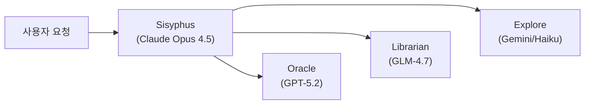
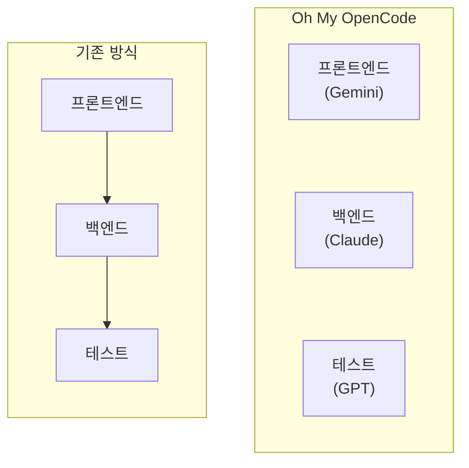
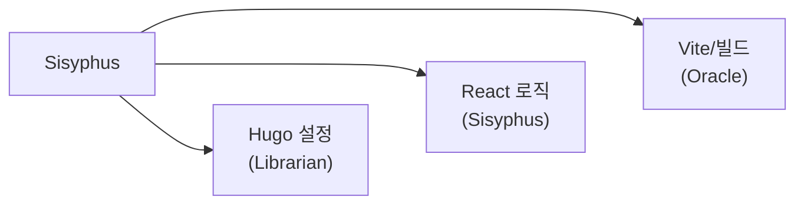

## 들어가며

AI 코딩 도구는 대부분 하나의 에이전트가 순차적으로 작업한다. 프롬프트를 주면 응답하고, 다음 프롬프트를 기다린다.

Oh My OpenCode는 이 패러다임을 깬다. **7개의 특화 에이전트가 동시에 작업**한다. Gemini가 프론트엔드를 만드는 동안 Claude가 백엔드를 짜고, 막히면 GPT를 불러 디버깅한다.

한국 개발자 code-yeongyu가 AI 도구에 $24,000 상당의 토큰을 사용한 경험을 바탕으로 만들었다. GitHub 스타 15,000개를 넘긴 이 도구의 핵심을 살펴본다.

---

## 핵심 개념

### Sisyphus: 끊임없이 굴리는 돌

> "시시포스는 신들을 속인 벌로 영원히 바위를 굴려야 했다. LLM 에이전트도 마찬가지다. 매일 자신의 '돌'—생각—을 굴린다."

Sisyphus는 Oh My OpenCode의 핵심 오케스트레이터다. Claude Opus 4.5 기반으로, 32K 토큰의 Extended Thinking을 활용해 복잡한 작업을 계획하고 위임한다.



### 특화 에이전트 구성

| 에이전트 | 모델 | 역할 |
|---------|------|------|
| **Sisyphus** | Claude Opus 4.5 | 계획, 위임, 전체 조율 |
| **Oracle** | GPT-5.2 | 아키텍처, 코드 리뷰, 전략 |
| **Librarian** | GLM-4.7 Free | 문서 탐색, 멀티 레포 분석 |
| **Explore** | Gemini/Haiku | 빠른 코드베이스 탐색 |

Sisyphus가 작업을 받으면 복잡도를 분석해 적절한 에이전트에 위임한다. 단순 탐색은 Explore로, 깊은 분석은 Oracle로 보낸다.

---

## 설치

### 1단계: OpenCode 설치

```bash
curl -fsSL https://opencode.ai/install | bash
```

### 2단계: Oh My OpenCode 플러그인 설치

```bash
bunx oh-my-opencode install
```

npm을 선호하면 이렇게 한다.

```bash
npm install -g oh-my-opencode
```

### 3단계: 프로젝트에서 실행

```bash
cd your-project
opencode
```

처음 실행하면 프로젝트 구조를 자동으로 인덱싱한다.

---

## 설정

### 설정 파일 위치

```
~/.config/opencode/oh-my-opencode.json    # 전역 설정
.opencode/oh-my-opencode.json             # 프로젝트별 설정 (우선)
```

### 기본 설정 예시

```json
{
  "agents": {
    "planner-sisyphus": true,
    "librarian": true,
    "oracle": true
  },
  "disabled_hooks": [],
  "disabled_mcps": [],
  "experimental": {
    "preemptive_compaction_threshold": 0.8,
    "auto_resume": true
  }
}
```

### 주요 설정 항목

**agents**: 사용할 에이전트 활성화/비활성화. 비용 절감을 위해 일부만 켤 수 있다.

**disabled_hooks**: 불필요한 훅 비활성화. `auto-update-checker`, `startup-toast` 등을 끄면 시작이 빨라진다.

**disabled_mcps**: MCP 서버 비활성화. Context7과 grep.app이 기본 활성화되어 있다.

---

## 핵심 기능

### 1. 병렬 에이전트 실행

Oh My OpenCode의 핵심 가치다. 하나의 작업을 여러 에이전트가 동시에 처리한다.



기존 방식은 순차 실행이다. 프론트엔드가 끝나야 백엔드를 시작한다. Oh My OpenCode는 세 작업을 동시에 진행한다.

### 2. Todo 기반 워크플로우

Sisyphus는 2개 이상의 단계가 필요한 작업을 받으면 즉시 Todo를 생성한다.

```
작업 요청: "사용자 인증 시스템 구현해줘"
    ↓
Sisyphus가 Todo 생성:
  [ ] DB 스키마 설계 → Oracle 위임
  [ ] 인증 로직 구현 → Sisyphus 직접 처리
  [ ] 프론트엔드 폼 → Explore로 참조 찾기 후 구현
  [ ] 테스트 작성 → 병렬 실행
```

이 Todo가 전체 진행 상황을 추적하는 중심축이 된다.

### 3. 백그라운드 실행

`run_in_background` 옵션으로 에이전트를 백그라운드에서 실행한다.

실제 사용 흐름은 이렇다.

1. 대규모 검색을 백그라운드로 시작
2. 다른 구현 작업을 진행
3. 검색 결과가 오면 Sisyphus가 알림
4. 결과를 활용해 작업 계속

### 4. Ultrawork 모드

`ultrawork` 또는 `ulw` 키워드를 사용하면 공격적인 병렬 실행 모드가 활성화된다.

핵심 원칙은 **"Background First"**다. 독립적인 에이전트 호출은 동시에 발사하고, 절대 순차적으로 기다리지 않는다.

---

## 실전 예시

### Hugo/React 하이브리드 프로젝트

실제 사례로, PDF Merge 기능을 1.5시간 만에 완성한 케이스가 있다.

작업 범위는 다음과 같았다.
- Hugo 설정 수정
- React 컴포넌트 추가
- Vite 설정 업데이트
- 커스텀 빌드 스크립트 수정

일반 도구로는 각 영역을 순차적으로 처리해야 한다. Oh My OpenCode는 이렇게 분할했다.



세 영역이 동시에 진행되어 작업 시간이 대폭 단축됐다.

---

## 훅 시스템

20개 이상의 내장 훅이 워크플로우를 자동화한다.

### 주요 훅

| 훅 | 기능 |
|----|------|
| `todo-continuation-enforcer` | Todo 완료까지 작업 지속 강제 |
| `context-window-monitor` | 컨텍스트 한도 접근 시 경고 |
| `session-recovery` | 세션 복구 지원 |
| `background-notification` | 백그라운드 작업 완료 알림 |
| `empty-task-response-detector` | 빈 응답 감지 및 재시도 |

### 훅 비활성화

불필요한 훅은 설정에서 끈다.

```json
{
  "disabled_hooks": [
    "auto-update-checker",
    "startup-toast",
    "comment-checker"
  ]
}
```

---

## MCP 통합

Context7과 grep.app MCP가 기본 활성화되어 있다.

- **Context7**: 라이브러리 문서를 실시간으로 가져온다
- **grep.app**: GitHub 전체에서 코드를 검색한다

추가 MCP 설정은 OpenCode의 표준 방식을 따른다.

```json
{
  "mcpServers": {
    "github": {
      "command": "npx",
      "args": ["@modelcontextprotocol/server-github"]
    }
  }
}
```

---

## Claude Code 호환성

Oh My OpenCode는 Claude Code의 주요 기능과 호환된다.

| 기능 | 호환 여부 |
|------|----------|
| Commands | ✅ |
| Skills | ✅ |
| Agents | ✅ |
| MCP | ✅ |
| Hooks (Pre/Post/Stop) | ✅ |

기존 Claude Code 설정을 그대로 사용할 수 있다. `.claude/` 디렉토리의 설정이 자동으로 로드된다.

---

## 비용 고려사항

멀티 에이전트는 토큰 소비가 많다. 비용 최적화 전략이 필요하다.

### 에이전트별 비용 특성

| 에이전트 | 모델 | 비용 수준 |
|---------|------|----------|
| Sisyphus | Claude Opus 4.5 | 높음 |
| Oracle | GPT-5.2 | 높음 |
| Librarian | GLM-4.7 Free | 무료 |
| Explore | Gemini Flash/Haiku | 낮음 |

### 비용 절감 팁

1. **단순 작업은 Explore로**: 파일 검색, 코드 탐색은 저비용 에이전트 활용
2. **Librarian 적극 사용**: 문서 탐색은 무료 모델로 처리
3. **불필요한 에이전트 비활성화**: 프로젝트 특성에 맞게 조정

---

## 트러블슈팅

### OpenCode 버전 호환성

OpenCode 1.0.132 이하에서는 설정 버그가 있다. 최신 버전으로 업데이트한다.

```bash
curl -fsSL https://opencode.ai/install | bash
```

### 에이전트 응답 없음

컨텍스트 윈도우가 꽉 찼을 가능성이 높다. `context-window-monitor` 훅이 경고를 주지만, 놓쳤다면 세션을 새로 시작한다.

### Rate Limit 도달

Google 계정을 여러 개 연결하면 자동 전환된다. 최대 10개 계정 지원.

---

## 정리

Oh My OpenCode는 단일 에이전트의 한계를 멀티 에이전트 협업으로 극복한다.

**적합한 상황**
- 여러 영역을 동시에 수정하는 대규모 작업
- 복잡한 빌드 파이프라인이 있는 프로젝트
- 다양한 기술 스택을 넘나드는 작업

**부적합한 상황**
- 단순한 버그 수정
- 토큰 비용이 민감한 환경
- 단일 파일 수정

병렬 처리가 필요한 복잡한 프로젝트라면 시도해볼 가치가 있다.

---

## 참고 자료

- [Oh My OpenCode GitHub](https://github.com/code-yeongyu/oh-my-opencode)
- [공식 문서](https://ohmyopencode.com/documentation/)
- [OpenCode 공식 사이트](https://opencode.ai/)
