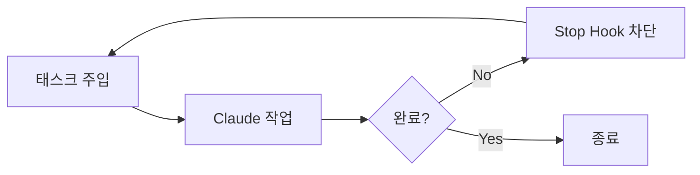
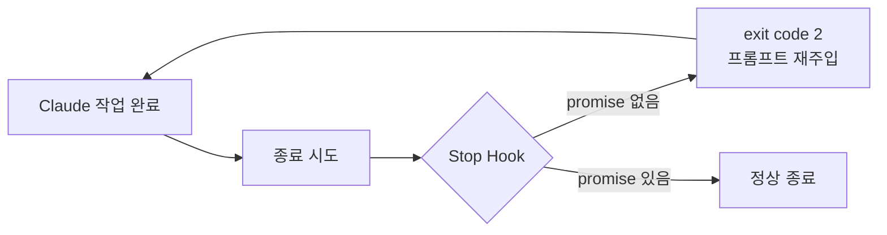

## 들어가며

Claude Code에 작업을 맡기고 자리를 비운다. 몇 시간 뒤 돌아오면 기능이 완성되어 있다. 테스트도 통과하고, 커밋도 되어 있다.

Ralph Loop는 이 시나리오를 현실로 만든다. 심슨의 Ralph Wiggum 캐릭터에서 이름을 따온 이 기법은 **"끈질긴 반복"**이라는 단순한 원리에 기반한다.

> "처음부터 완벽할 필요 없다. 루프가 다듬어준다."

개발자 Geoffrey Huntley가 고안한 이 접근법은 이제 Claude Code의 공식 플러그인으로 제공된다.

---

## 핵심 원리

### 단순한 while 루프

Ralph의 본질은 놀랍도록 단순하다.



1. 태스크를 Claude에 전달한다
2. Claude가 작업을 수행한다
3. Claude가 종료하려 한다
4. Stop Hook이 종료를 차단한다
5. 같은 프롬프트를 다시 주입한다
6. 완료 조건을 만족할 때까지 반복한다

이전 반복에서 수정한 파일들이 그대로 남아있다. 각 반복은 이전 작업 위에 쌓인다.

### 왜 Ralph Wiggum인가

심슨의 Ralph Wiggum은 영리하지 않다. 하지만 무엇이든 계속 시도한다. 이 캐릭터가 상징하는 것은 **순진하지만 끈질긴 집요함**이다.

AI 에이전트도 마찬가지다. 한 번에 완벽한 결과를 내지 못할 수 있다. 하지만 계속 시도하면 결국 도달한다.

> "결정론적으로 실패하는 것이 비결정론적으로 성공하는 것보다 낫다."

실패가 예측 가능하면 프롬프트를 튜닝할 수 있다. 성공이 운에 좌우되면 재현할 수 없다.

---

## 설치

### 방법 1: 공식 플러그인

Claude Code의 플러그인 시스템을 통해 설치한다.

```bash
claude /plugins install ralph-wiggum
```

### 방법 2: frankbria 확장 버전

더 많은 기능이 필요하면 커뮤니티 확장 버전을 사용한다.

```bash
git clone https://github.com/frankbria/ralph-claude-code
cd ralph-claude-code
./install.sh
```

설치 후 `ralph`, `ralph-monitor`, `ralph-setup` 명령어가 PATH에 추가된다.

---

## 기본 사용법

### 루프 시작

```bash
/ralph-loop "모든 테스트를 통과시켜" --max-iterations 20
```

### 완료 조건 지정

```bash
/ralph-loop "API 리팩토링" --max-iterations 30 --completion-promise "DONE"
```

`--completion-promise`는 Claude가 출력해야 할 완료 신호다. 이 문자열이 응답에 포함되면 루프가 종료된다.

### 루프 중단

```bash
/cancel-ralph
```

재개하려면 같은 명령을 다시 실행한다. Claude가 git 히스토리에서 이전 작업을 파악한다.

---

## Stop Hook의 작동 방식

Ralph의 핵심은 **Stop Hook**이다.



Claude가 작업을 마치고 종료하려 하면, Stop Hook이 응답을 검사한다.

- **완료 promise가 없다**: exit code 2를 반환하고, 원래 프롬프트를 다시 주입한다
- **완료 promise가 있다**: 정상 종료를 허용한다

이 메커니즘이 **"자기 참조 피드백 루프"**를 만든다. Claude는 이전 작업의 결과를 보고, 에러 로그를 읽고, 다시 시도한다.

---

## 안전 장치

Ralph Loop는 여러 겹의 안전 장치를 갖추고 있다.

### 1. 최대 반복 횟수

```bash
--max-iterations 25
```

**필수 설정이다.** `--completion-promise`는 정확한 문자열 매칭을 사용하므로 신뢰할 수 없다. 반복 횟수가 실질적인 안전망이다.

### 2. Rate Limiting

시간당 호출 횟수를 제한한다. 기본값은 100회/시간이며 설정으로 조정 가능하다.

### 3. Circuit Breaker

연속 실패가 감지되면 루프를 자동 중단한다. 같은 에러가 반복되면 무한 루프에 빠진 것으로 판단한다.

### 4. 세션 만료

기본 24시간 후 자동 종료된다. 주말 내내 돌아가는 상황을 방지한다.

### 5. API 한도 감지

Claude의 5시간 사용량 한도에 도달하면 대기/종료 옵션을 제시한다.

### 품질 게이트

frankbria 버전은 5단계 품질 게이트를 적용한다.

```
Rate Limit 검사 → Circuit Breaker → 종료 감지 → Claude 실행 → 후처리 분석
```

각 단계에서 문제가 발견되면 적절히 처리한다.

---

## 프롬프트 작성법

Ralph의 성공은 **프롬프트 품질**에 달려있다.

### 좋은 프롬프트의 구조

```markdown
## 요구사항
- 모든 API 엔드포인트에 입력 검증 추가
- 에러 응답을 RFC 7807 형식으로 통일

## 성공 조건
- 모든 테스트 통과
- 린터 에러 없음
- 커버리지 80% 이상

## 완료 시
<promise>COMPLETE</promise> 출력
```

### 핵심 요소

| 요소 | 역할 |
|------|------|
| **요구사항** | 무엇을 해야 하는지 명확히 |
| **성공 조건** | 객관적으로 측정 가능한 기준 |
| **완료 신호** | 루프 종료를 위한 promise |

### 피해야 할 것

**모호한 요구사항**은 Claude가 불필요한 기능을 추가하게 만든다. "성능 개선해줘"보다 "쿼리 응답 시간 100ms 이하로"가 낫다.

**명시적 참조 부족**은 의도치 않은 수정을 유발한다. 기존 코드의 위치와 패턴을 언급한다.

---

## 적합한 사용 사례

Ralph Loop가 빛나는 상황이 있다.

### 1. 대규모 리팩토링

프레임워크 마이그레이션, 의존성 업그레이드, API 버전 변경. 수백 개 파일을 건드려야 하는 작업이다.

```bash
/ralph-loop "모든 React 클래스 컴포넌트를 함수형으로 변환" --max-iterations 50
```

### 2. 테스트 커버리지 확보

```bash
/ralph-loop "src/ 디렉토리의 모든 함수에 단위 테스트 추가, 커버리지 90% 달성" --max-iterations 40
```

실패하는 테스트가 있으면 고치고, 누락된 테스트가 있으면 추가한다. 목표 달성까지 반복한다.

### 3. 문서화

```bash
/ralph-loop "모든 public API에 JSDoc 추가" --max-iterations 30
```

### 4. 지원 티켓 일괄 처리

여러 이슈를 순차적으로 처리하는 배치 작업에 적합하다.

---

## 적합하지 않은 상황

### 탐색적 작업

"이 코드를 어떻게 개선할 수 있을까?"같은 열린 질문은 Ralph에 맞지 않다. 명확한 종료 조건이 없기 때문이다.

### 아키텍처 설계

설계 결정이 필요한 작업은 인간의 판단이 필요하다. Ralph는 실행에 강하지, 결정에 강하지 않다.

### 빠른 수정

단순 버그 수정에 루프를 돌리는 것은 과잉이다. 직접 지시하는 것이 빠르다.

---

## 비용 고려사항

**Ralph Loop는 토큰을 많이 소비한다.**

| 상황 | 예상 비용 |
|------|----------|
| 소규모 (10회 반복) | $5-15 |
| 중규모 (30회 반복) | $20-50 |
| 대규모 (50회 반복, 큰 코드베이스) | $50-100+ |

### 비용 최적화

1. **`--max-iterations` 보수적 설정**: 5-10회로 시작해서 필요시 늘린다
2. **컨텍스트 최소화**: 관련 파일만 포함되도록 `.claudeignore` 활용
3. **명확한 범위 지정**: "전체 코드베이스"보다 "src/api/ 디렉토리"

### 구독 사용자 주의

Claude Code 구독의 사용량 한도를 빠르게 소진할 수 있다. 대규모 루프 전에 잔여 한도를 확인한다.

---

## 실전 팁

### 1. 처음에는 지켜보기

첫 실행은 직접 관찰한다. 이상한 행동이 보이면 즉시 중단하고 프롬프트를 조정한다. 신뢰가 쌓이면 점차 자율성을 높인다.

### 2. Backpressure 활용

> "에이전트에게 무엇을 하라고 지시하는 대신, 잘못된 출력이 자동으로 거부되는 환경을 설계한다."

테스트가 실패하면 루프가 계속된다. 린터가 에러를 내면 루프가 계속된다. 이 **자연스러운 압력**이 에이전트를 올바른 방향으로 밀어낸다.

### 3. 작은 단위로 시작

거대한 작업을 한 번에 맡기지 않는다. 작은 단위로 나눠서 각각 루프를 돌린다.

```
❌ "전체 앱을 TypeScript로 마이그레이션"
✅ "src/utils/ 디렉토리를 TypeScript로 변환"
```

### 4. Git 브랜치 활용

루프 실행 전 새 브랜치를 만든다. 결과가 마음에 들지 않으면 버리면 된다.

```bash
git checkout -b ralph/api-refactor
/ralph-loop "..."
```

---

## 트러블슈팅

### 무한 루프에 빠짐

`--max-iterations`가 설정되어 있는지 확인한다. 프롬프트에 달성 불가능한 조건이 있는지 검토한다.

### 불필요한 기능 추가

프롬프트가 너무 모호하다. 스펙을 구체화하고 **"이것만 하고, 다른 것은 건드리지 마라"**를 명시한다.

### 같은 실패 반복

Circuit Breaker가 작동해야 하지만, 작동하지 않는다면 프롬프트에 문제가 있다. 실패 원인을 파악하고 해결 방법을 프롬프트에 포함시킨다.

---

## YOLO 모드 주의사항

Ralph Loop는 `--dangerously-skip-permissions` 플래그가 필요한 경우가 많다. 이 모드에서는 Claude가 **모든 파일 수정과 명령 실행을 승인 없이** 수행한다.

위험을 최소화하려면:
- 새 브랜치에서만 실행
- 중요하지 않은 코드베이스에서 먼저 테스트
- 정기적으로 git status 확인

---

## 정리

Ralph Loop는 **반복의 힘**을 활용한다. 한 번에 완벽하지 않아도 된다. 계속 시도하면 목표에 도달한다.

**핵심 원칙**
- 명확한 완료 조건을 정의한다
- 안전 장치(max-iterations)를 설정한다
- 작은 단위로 시작해서 신뢰를 쌓는다

**적합한 작업**
- 대규모 리팩토링
- 테스트 커버리지 확보
- 반복적인 코드 수정

밤새 코드를 다듬어주는 조용한 동료가 필요하다면, Ralph에게 맡겨보자.

---

## 참고 자료

- [Ralph Wiggum - Awesome Claude](https://awesomeclaude.ai/ralph-wiggum)
- [frankbria/ralph-claude-code GitHub](https://github.com/frankbria/ralph-claude-code)
- [공식 플러그인 문서](https://github.com/anthropics/claude-code/blob/main/plugins/ralph-wiggum/README.md)
- [11 Tips for AI Coding with Ralph](https://www.aihero.dev/tips-for-ai-coding-with-ralph-wiggum)
