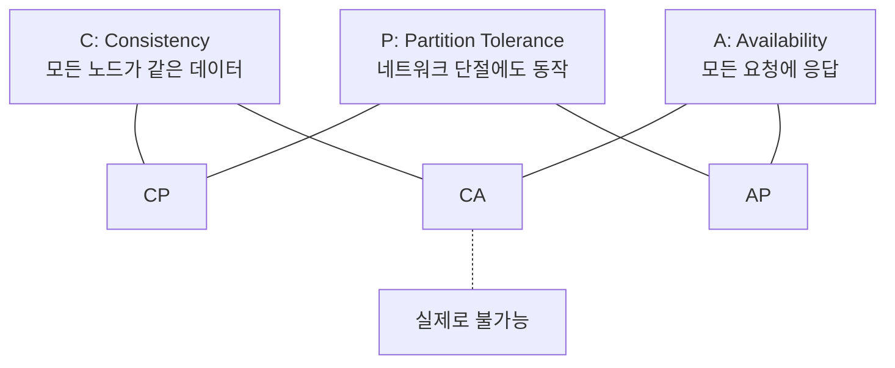
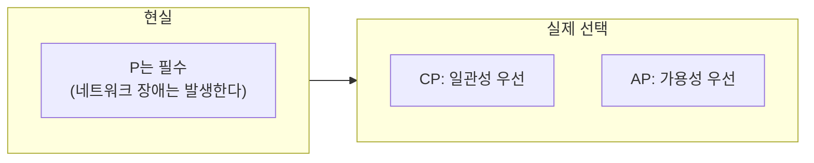
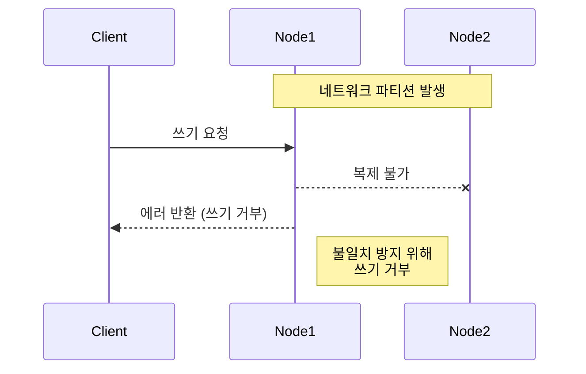
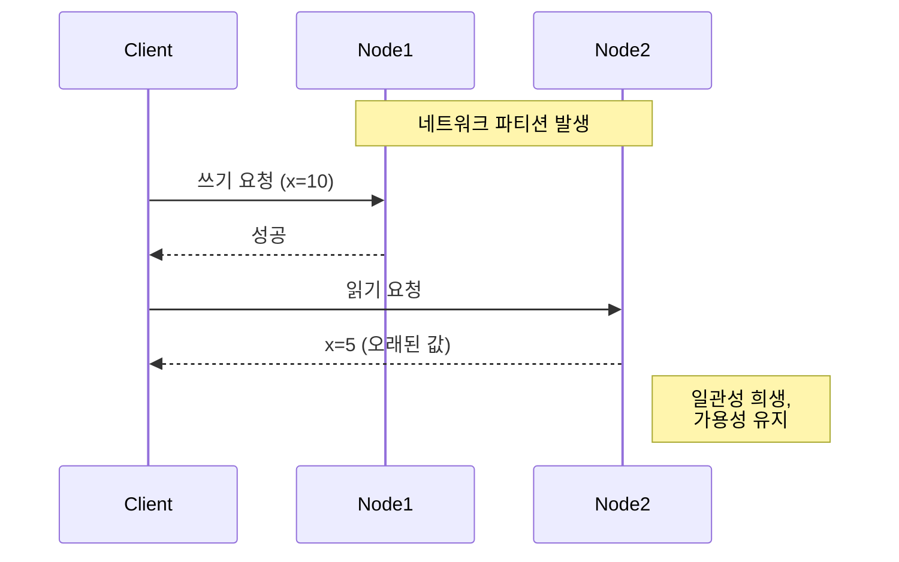
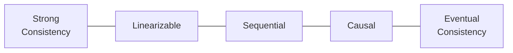
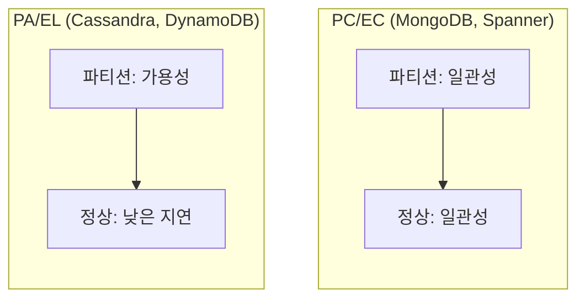
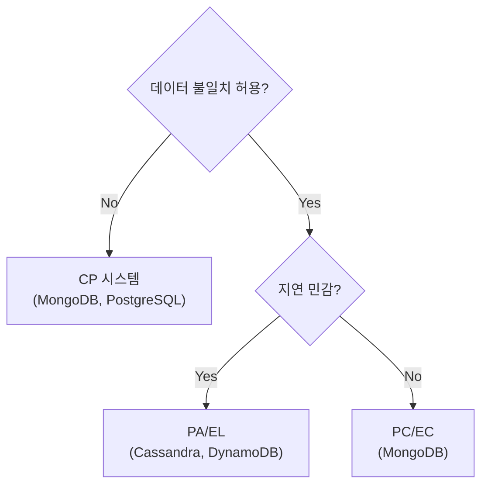
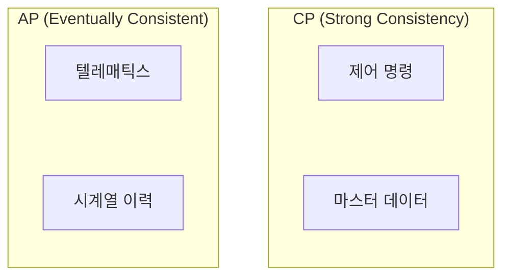

분산 시스템을 설계할 때 "일관성과 가용성 중 뭘 선택할 건가요?"라는 질문을 자주 받는다. 이 질문의 근거가 바로 CAP 이론이다. 2000년에 제안된 이 이론은 20년이 넘은 지금도 시스템 설계의 기본 프레임워크로 사용된다.

## CAP 이론이란?

> "Of three properties of shared-data systems—data consistency, system availability, and tolerance to network partitions—only two can be achieved at any given time."
> — Eric Brewer, 2000

Eric Brewer가 2000년에 제안하고, 2002년 Seth Gilbert와 Nancy Lynch가 수학적으로 증명한 정리다. **분산 데이터 저장소는 세 가지 속성을 동시에 만족할 수 없다.**



### 세 가지 속성

| 속성 | 정의 | 의미 |
|------|------|------|
| **Consistency** | 모든 노드가 동일한 데이터를 본다 | 쓰기 직후 읽으면 최신 값 반환 |
| **Availability** | 모든 요청에 응답을 반환한다 | 장애 노드 제외, 응답 지연은 허용 |
| **Partition Tolerance** | 네트워크 분할에도 시스템이 동작한다 | 노드 간 통신 끊겨도 서비스 유지 |

### "셋 중 둘만 선택"의 의미

흔히 "CAP 중 2개를 선택한다"고 설명하지만, 이는 오해를 유발한다.



**핵심 통찰:**
- 네트워크 파티션은 **피할 수 없다** (하드웨어 장애, 네트워크 지연)
- 따라서 P는 선택이 아니라 **필수**
- 실제 선택은 **파티션 발생 시** C와 A 중 무엇을 희생할지다

## CP vs AP: 실제 선택

### CP 시스템 (Consistency + Partition Tolerance)

파티션 발생 시 일관성을 유지하고, 가용성을 희생한다.



**특징:**
- 파티션 시 쓰기 거부 또는 타임아웃
- 데이터 불일치는 절대 허용 안 함
- 복구 후 정상 동작

**예시 시스템:**

| 시스템 | 설명 |
|--------|------|
| MongoDB | Primary 장애 시 새 Primary 선출까지 쓰기 불가 |
| HBase | ZooKeeper 쿼럼 유지 필요 |
| Redis Cluster | 과반수 노드 필요 |

**적합한 유스케이스:**
- 금융 거래 (잔액 불일치 불가)
- 재고 관리 (초과 판매 방지)
- 분산 락 (중복 실행 방지)

### AP 시스템 (Availability + Partition Tolerance)

파티션 발생 시 가용성을 유지하고, 일관성을 희생한다.



**특징:**
- 파티션 시에도 읽기/쓰기 허용
- 일시적 데이터 불일치 허용 (Eventually Consistent)
- 파티션 복구 후 데이터 병합

**예시 시스템:**

| 시스템 | 설명 |
|--------|------|
| Cassandra | 모든 노드가 쓰기 가능, 나중에 동기화 |
| DynamoDB | 기본 Eventual Consistency |
| CouchDB | 충돌 해결 메커니즘 내장 |

**적합한 유스케이스:**
- 소셜 미디어 피드 (잠깐 옛날 글 보여도 OK)
- 장바구니 (일시적 불일치 허용)
- IoT 텔레매틱스 (다음 데이터로 덮어씀)

### CA 시스템?

이론적으로 CA(Consistency + Availability)는 파티션이 없을 때만 가능하다.

```
단일 노드 PostgreSQL = CA
→ 파티션 자체가 불가능 (노드가 하나니까)
→ 분산 시스템이 아님
```

분산 환경에서 CA는 **존재하지 않는다.**

## CAP의 한계

CAP 이론은 유용하지만 비판도 많다.

### 문제점 1: 이진 선택의 오류

CAP은 C와 A를 이진(binary)으로 본다. 하지만 실제로는 **스펙트럼**이다.



| 일관성 수준 | 설명 | 예시 |
|------------|------|------|
| Linearizable | 모든 연산이 실시간 순서대로 | Spanner |
| Sequential | 단일 클라이언트 순서 보장 | - |
| Causal | 인과관계 있는 연산만 순서 보장 | MongoDB |
| Eventual | 언젠가는 일관됨 | Cassandra |

### 문제점 2: 가용성 정의 모호

CAP의 Availability는 **응답 시간을 정의하지 않는다.**

```
1시간 후 응답해도 "Available"인가?
→ CAP에 따르면 Yes
→ 현실에서는 No (SLA 위반)
```

### 문제점 3: 파티션 판단 기준

언제 "파티션"인가?

```
- 패킷 1개 유실?
- 1초 지연?
- 10초 지연?
```

명확한 기준이 없다.

## PACELC: CAP의 확장

Daniel Abadi가 2010년에 제안한 PACELC 이론은 CAP의 한계를 보완한다.

> "Ignoring the consistency/latency trade-off of replicated systems is a major oversight, as it is present at all times during system operation."
> — Daniel Abadi

### PACELC 정의

```
P(artition) → A(vailability) vs C(onsistency)
E(lse) → L(atency) vs C(onsistency)
```

**파티션 상황:**
- CAP과 동일하게 A vs C 선택

**정상 상황 (파티션 없음):**
- **Latency vs Consistency** 선택
- 복제본 동기화 대기 → 일관성 ↑, 지연 ↑
- 복제본 동기화 안 기다림 → 일관성 ↓, 지연 ↓

### PACELC 분류

| 시스템 | 분류 | 파티션 시 | 정상 시 |
|--------|------|----------|--------|
| Cassandra | PA/EL | Availability | Latency 우선 |
| DynamoDB | PA/EL | Availability | Latency 우선 |
| MongoDB | PC/EC | Consistency | Consistency 우선 |
| Spanner | PC/EC | Consistency | Consistency 우선 |
| PNUTS | PC/EL | Consistency | Latency 우선 |



### 왜 PACELC가 더 유용한가?

**파티션은 드물다.** 대부분의 시간은 정상 운영 상태다.

```
AWS 가용 영역 간 파티션 빈도: 연 수 회
정상 운영 시간: 99.9%+
```

CAP은 드문 상황(파티션)만 다루지만, PACELC는 **일상적인 지연-일관성 트레이드오프**도 포함한다.

## 실전 적용

### 도메인에 따른 선택



| 도메인 | 권장 | 이유 |
|--------|------|------|
| 금융 거래 | PC/EC | 잔액 불일치 절대 불가 |
| 실시간 채팅 | PA/EL | 메시지 순서보다 응답 속도 |
| 재고 관리 | PC/EC | 초과 판매 방지 |
| IoT 텔레매틱스 | PA/EL | 데이터 유실돼도 다음 것으로 대체 |
| 소셜 피드 | PA/EL | 잠깐 옛날 글 보여도 OK |
| 분산 락 | PC/EC | 중복 실행 방지 필수 |

### 같은 시스템, 다른 설정

대부분의 현대 데이터베이스는 **일관성 수준을 조절**할 수 있다.

**Cassandra:**
```
# 높은 일관성 (QUORUM)
읽기: R=2, 쓰기: W=2 (노드 3개 중)
→ R + W > N 이면 강한 일관성

# 높은 가용성 (ONE)
읽기: R=1, 쓰기: W=1
→ 빠르지만 불일치 가능
```

**DynamoDB:**
```
# Strongly Consistent Read
읽기 시 최신 값 보장, 지연 증가

# Eventually Consistent Read (기본)
빠르지만 최신 아닐 수 있음
```

### Vehicle Platform 사례

차량 텔레매틱스 시스템을 예로 들면:

| 데이터 | 선택 | 이유 |
|--------|------|------|
| 차량 실시간 상태 | AP | 위치/속도는 다음 데이터로 덮어씀 |
| 제어 명령 결과 | CP | 시동 ON/OFF 상태 불일치 불가 |
| 마스터 데이터 | CP | 차량 정보 불일치 불가 |
| 시계열 이력 | AP | 일부 누락돼도 분석에 큰 영향 없음 |



## 정리

### CAP 핵심

1. 분산 시스템에서 P(Partition Tolerance)는 **필수**
2. 실제 선택은 파티션 시 **C vs A**
3. CA 시스템은 분산 환경에서 **존재하지 않음**

### PACELC로 확장

1. 정상 운영 시에도 **L vs C** 트레이드오프 존재
2. 대부분의 시간은 정상 상태 → PACELC가 더 실용적
3. PA/EL(가용성+지연) vs PC/EC(일관성) 분류

### 실전 팁

1. **도메인 특성**에 맞게 선택
2. 같은 시스템도 **설정으로 조절** 가능
3. 하나의 서비스 안에서도 **데이터별로 다른 전략** 적용

---

## 참고 자료

- [CAP Theorem - Wikipedia](https://en.wikipedia.org/wiki/CAP_theorem)
- [PACELC Theorem - Wikipedia](https://en.wikipedia.org/wiki/PACELC_theorem)
- [CAP and PACELC: Thinking More Clearly About Consistency](https://brooker.co.za/blog/2014/07/16/pacelc.html)
- [CAP Theorem Explained - AlgoMaster](https://blog.algomaster.io/p/cap-theorem-explained)
- [A Deep Dive into the Trade-offs of the CAP Theorem](https://medium.com/@techWithAditya/a-deep-dive-into-the-trade-offs-of-the-cap-theorem-and-their-practical-implications-for-distributed-6021694ad258)
- [What is the CAP Theorem? - ScyllaDB](https://www.scylladb.com/glossary/cap-theorem/)
