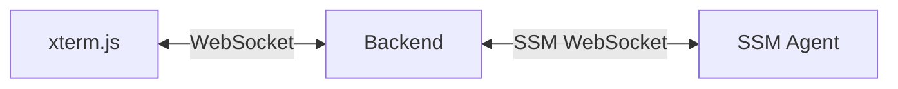
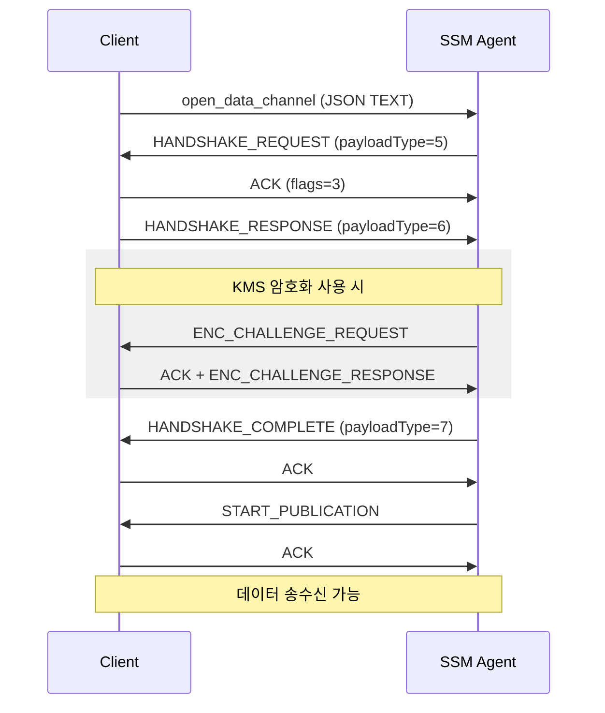
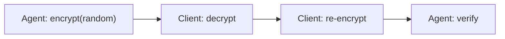
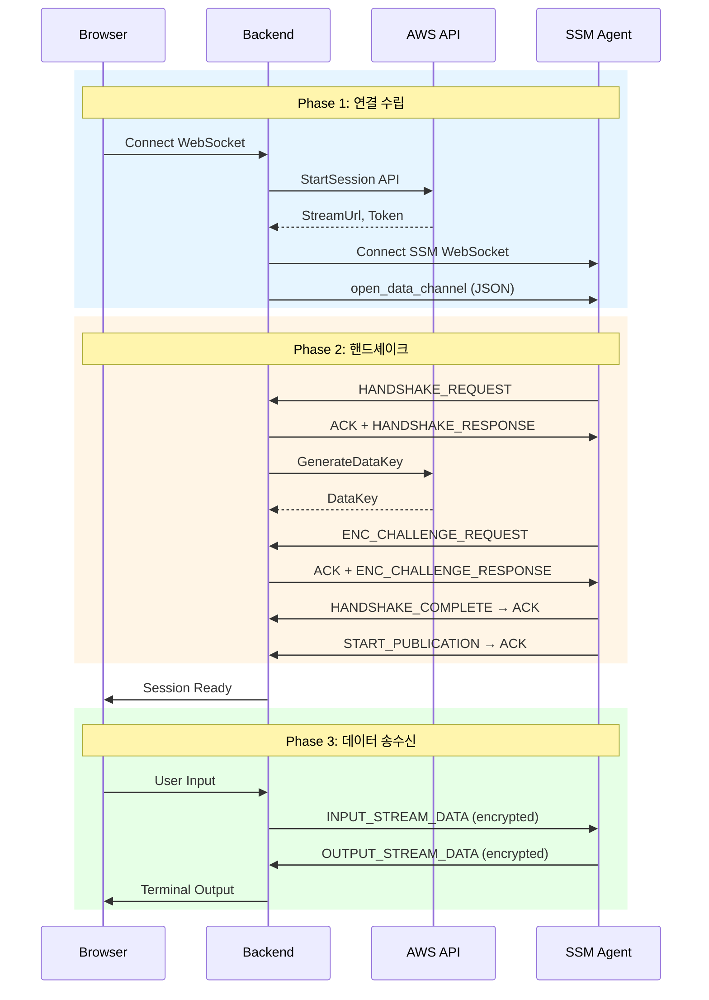

## 배경

차량에 설치된 IoT 디바이스에 원격 터미널 접속이 필요했다. AWS SSM Agent가 이미 설치되어 있었고, 웹 브라우저에서 터미널을 제공해야 했다.



### session-manager-plugin의 한계

AWS가 제공하는 `session-manager-plugin`은 Go 바이너리 CLI 도구다.

| 문제점 | 설명 |
|--------|------|
| 라이브러리 불가 | Java/Kotlin 서버에서 import 불가 |
| 불안정한 파이핑 | 외부 프로세스 stdin/stdout 파이핑 |
| 관리 복잡 | 다중 사용자 동시 접속 시 프로세스 관리 |

### 공식 문서의 부재

AWS 공식 문서에서 SSM 프로토콜 스펙을 찾아봤지만 StartSession API 사용법만 있었다. 프로토콜 스펙, 바이너리 포맷, 핸드셰이크 정보는 없었다.

결론은 리버스 엔지니어링이다.

---

## 분석 대상

다행히 AWS가 클라이언트 코드를 오픈소스로 공개했다.

| 레포지토리 | 언어 | 용도 |
|-----------|------|------|
| [aws/session-manager-plugin](https://github.com/aws/session-manager-plugin) | Go | AWS 공식 CLI 플러그인 |
| [aws/amazon-ssm-agent](https://github.com/aws/amazon-ssm-agent) | Go | SSM Agent (서버 측) |
| [mmmorris1975/ssm-session-client](https://github.com/mmmorris1975/ssm-session-client) | Go | 커뮤니티 구현체 |

분석 전략은 이렇다. 먼저 커뮤니티 구현체로 전체 흐름을 파악한다. 코드가 더 읽기 쉽기 때문이다. 그 다음 AWS 공식 코드로 세부 스펙을 검증하고, 실제 구현 후 패킷 캡처로 디버깅한다.

핵심 파일 위치는 `session-manager-plugin`의 `src/message/clientmessage.go`(바이너리 메시지 포맷), `src/datachannel/streaming.go`(핸드셰이크, 암호화), `src/encryption/encrypter.go`(KMS 암호화)다.

---

## Phase 1: 연결 수립

### Step 1: StartSession API 호출

먼저 AWS API로 세션을 시작한다.

```kotlin
val response = ssmClient.startSession(
    StartSessionRequest {
        target = "mi-0123456789abcdef0"
    }
)

// sessionId, streamUrl, tokenValue를 받는다
```

### Step 2: WebSocket 연결

`streamUrl`로 WebSocket 연결을 맺는다.

### Step 3: 인증 메시지 전송

**중요: 첫 번째 메시지만 JSON 텍스트, 이후는 모두 바이너리다.**

```kotlin
val authMessage = """{
    "MessageSchemaVersion": "1.0",
    "RequestId": "${UUID.randomUUID()}",
    "TokenValue": "$tokenValue",
    "ClientId": "${UUID.randomUUID()}",
    "ClientVersion": "1.0.0"
}"""

wsClient.send(authMessage)  // TEXT 프레임으로 전송
```

---

## Phase 2: 바이너리 메시지 포맷

인증 후 모든 메시지는 바이너리 포맷이다.

### 메시지 구조 (116 bytes 헤더 + payload)

| Offset | Field | Size | Description |
|--------|-------|------|-------------|
| 0-3 | HeaderLength | 4 bytes | 항상 116 (Big Endian) |
| 4-35 | MessageType | 32 bytes | UTF-8, 공백(0x20) 패딩 |
| 36-39 | SchemaVersion | 4 bytes | 스키마 버전 |
| 40-47 | CreatedDate | 8 bytes | epoch millis (UTC) |
| 48-55 | SequenceNumber | 8 bytes | 메시지 순서 번호 |
| 56-63 | Flags | 8 bytes | 제어 플래그 |
| 64-79 | MessageId | 16 bytes | UUID (특수 인코딩) |
| 80-111 | PayloadDigest | 32 bytes | SHA-256 해시 |
| 112-115 | PayloadType | 4 bytes | 페이로드 타입 |
| 116-119 | PayloadLength | 4 bytes | 페이로드 길이 |
| 120-... | Payload | 가변 | 실제 데이터 |

### MessageType 종류

| 타입 | 설명 | 방향 |
|------|------|------|
| `input_stream_data` | 키보드 입력 | 클라이언트 → Agent |
| `output_stream_data` | 터미널 출력 | Agent → 클라이언트 |
| `acknowledge` | ACK | 양방향 |
| `channel_closed` | 세션 종료 | 양방향 |
| `start_publication` | 데이터 전송 시작 | Agent → 클라이언트 |

### PayloadType 종류

| 값 | 타입 | 설명 |
|----|------|------|
| 1 | Output | 터미널 출력/입력 |
| 3 | Size | 터미널 크기 |
| 5 | HandshakeRequest | 핸드셰이크 요청 |
| 6 | HandshakeResponse | 핸드셰이크 응답 |
| 7 | HandshakeComplete | 핸드셰이크 완료 |
| 8 | EncChallengeRequest | 암호화 챌린지 요청 |
| 9 | EncChallengeResponse | 암호화 챌린지 응답 |

### 함정 1: MessageType 패딩

MessageType은 32바이트 고정인데, 남는 공간을 공백(0x20)으로 채운다.

```kotlin
val paddedMessageType = ByteArray(32) { ' '.code.toByte() }
System.arraycopy(messageTypeBytes, 0, paddedMessageType, 0, messageTypeBytes.size)
```

### 함정 2: UUID 인코딩

일반적인 UUID 직렬화와 다르다. 앞 8바이트와 뒤 8바이트가 교환된다.

```kotlin
// 인코딩 (전송 시)
buffer.putLong(messageId.leastSignificantBits)  // 먼저
buffer.putLong(messageId.mostSignificantBits)   // 나중에

// 디코딩 (수신 시)
val first8Bytes = buffer.long
val second8Bytes = buffer.long
val uuid = UUID(second8Bytes, first8Bytes)
```

---

## Phase 3: 핸드셰이크

WebSocket 연결 후 바로 데이터를 보낼 수 없다. 핸드셰이크가 필요하다.



### HANDSHAKE_REQUEST 페이로드

Agent가 핸드셰이크 요청을 보낸다. `RequestedClientActions` 배열에 세션 타입과 KMS 암호화 정보가 포함된다.

### HANDSHAKE_RESPONSE 페이로드

클라이언트가 응답을 보낸다. `ProcessedClientActions` 배열에 각 액션의 처리 결과를 담는다. `ActionStatus`는 1이면 Success, 2면 Failed, 3이면 Unsupported다.

### ACK 메시지 포맷

모든 메시지에 ACK를 보내야 한다.

```kotlin
val ackMessage = SsmMessage(
    messageType = "acknowledge",
    sequenceNumber = 0,  // ACK는 항상 0
    flags = 3,           // ACK 플래그
    payload = """{"AcknowledgedMessageId": "$messageId", ...}"""
)
```

---

## Phase 4: KMS 암호화

SSM 세션은 KMS를 통한 End-to-End 암호화를 지원한다.

### 암호화 키 생성

```kotlin
val response = kmsClient.generateDataKey(
    GenerateDataKeyRequest {
        keyId = kmsKeyId
        numberOfBytes = 64
        encryptionContext = mapOf(
            "aws:ssm:SessionId" to sessionId,
            "aws:ssm:TargetId" to targetId,
        )
    }
)

// 64바이트 키를 반으로 나눔
val decryptionKey = plaintextKey.copyOfRange(0, 32)   // Agent → Client
val encryptionKey = plaintextKey.copyOfRange(32, 64)  // Client → Agent
```

`encryptionContext`가 틀리면 Agent가 키를 복호화할 수 없다.

### 암호화 알고리즘

AES/GCM/NoPadding을 사용한다. IV는 12바이트, GCM 태그는 128비트다.

### 암호화 챌린지

Agent가 키가 올바른지 확인하기 위해 챌린지를 보낸다.



클라이언트는 Agent가 암호화한 데이터를 복호화하고, 다시 암호화해서 응답한다. Agent가 복호화해서 원본과 비교한다.

---

## Phase 5: 데이터 송수신

### START_PUBLICATION 대기

핸드셰이크가 끝나도 바로 데이터를 보내면 안 된다. Agent가 `start_publication` 메시지를 보내야 데이터 전송이 가능하다.

### 터미널 입력 전송

```kotlin
fun sendInput(input: ByteArray) {
    val encrypted = encryption.encrypt(input)  // OUTPUT은 암호화 필수
    val message = SsmMessage(
        messageType = "input_stream_data",
        payloadType = 1,  // OUTPUT
        payload = encrypted,
    )
    send(message.encode())
}
```

### 터미널 크기 전송

```kotlin
fun sendTerminalSize(rows: Int, cols: Int) {
    val payload = """{"cols":$cols,"rows":$rows}""".toByteArray()
    val message = SsmMessage(
        messageType = "input_stream_data",
        payloadType = 3,  // SIZE - 암호화하지 않음
        payload = payload,
    )
    send(message.encode())
}
```

SIZE 타입은 암호화하지 않는다.

---

## 구현 시 만난 함정들

| 함정 | 잘못된 구현 | 올바른 구현 |
|------|-------------|-------------|
| 첫 메시지 타입 | BINARY로 전송 | TEXT로 전송 |
| ACK 순서 | 처리 후 ACK | ACK 먼저, 처리 나중 |
| HeaderLength 값 | 120 | 116 (PayloadLength 제외) |
| START_PUBLICATION | 핸드셰이크 후 바로 전송 | 수신 후 전송 |
| 시퀀스 번호 | ACK도 증가 | ACK는 항상 0 |

---

## 전체 시퀀스



---

## 마치며

문서가 없어도 오픈소스가 있다면 리버스 엔지니어링이 가능하다. 패딩 문자 하나, 바이트 순서 하나가 전체를 망칠 수 있으니 패킷 캡처와 로깅으로 실제 동작을 확인하는 것이 중요하다.

### 참고 자료

- [aws/session-manager-plugin](https://github.com/aws/session-manager-plugin) - 공식 구현
- [aws/amazon-ssm-agent](https://github.com/aws/amazon-ssm-agent) - Agent 측 구현
- [mmmorris1975/ssm-session-client](https://github.com/mmmorris1975/ssm-session-client) - Go 클라이언트
- [bertrandmartel/aws-ssm-session](https://github.com/bertrandmartel/aws-ssm-session) - JS 클라이언트
