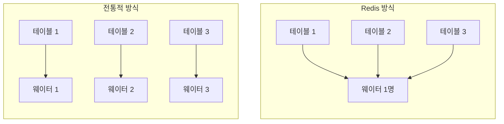

Redis는 **단일 스레드**로 수만 개의 클라이언트 연결을 동시에 처리한다. 이것이 가능한 이유가 바로 **I/O 멀티플렉싱**이다.

## 비유로 이해하기: 식당 웨이터

전통적인 멀티스레드 방식은 손님마다 웨이터를 한 명씩 배치하는 것과 같다. 손님 1000명이면 웨이터도 1000명이 필요하다. 대부분의 시간 동안 웨이터는 손님이 메뉴를 고르길 기다리며 아무것도 하지 않는다.

Redis의 멀티플렉싱 방식은 다르다. 웨이터 한 명이 모든 테이블을 담당하되, **손을 든 테이블만 방문**한다. 주문할 준비가 된 손님만 응대하므로 효율적이다.



## 동작 흐름


### 1단계: 이벤트 등록

클라이언트가 연결되면 해당 소켓을 epoll에 등록한다. "이 소켓에서 데이터가 오면 알려줘"라고 요청하는 것이다.

### 2단계: 이벤트 대기 (epoll_wait)

Event Loop가 epoll에게 물어본다. "준비된 소켓 있어?" 없으면 대기하고, 있으면 즉시 반환한다.

### 3단계: 이벤트 처리

준비된 소켓들만 순회하며 처리한다.
- 소켓 1: `GET key` → 값 반환
- 소켓 3: `SET key value` → OK 반환
- 소켓 2: 아직 준비 안 됨 → 건너뜀

### 4단계: 반복

1~3단계를 무한 반복한다.

## 핵심 시스템 콜: epoll

Redis Event Loop를 의사 코드로 표현하면 이렇다.

```c
while (true) {
    // 준비된 소켓들을 가져온다
    ready_sockets = epoll_wait(epoll_fd, events, timeout);

    // 준비된 소켓만 처리한다
    for (socket in ready_sockets) {
        if (socket.has_readable_data) {
            command = read(socket);
            result = execute(command);
            write(socket, result);
        }
    }
}
```

핵심은 **블로킹 없이 준비된 소켓만 처리**한다는 점이다.

## 왜 빠른가?

| 구분 | 멀티스레드 | 멀티플렉싱 (Redis) |
|------|-----------|-------------------|
| 컨텍스트 스위칭 | 스레드 전환 비용 발생 | 없음 (단일 스레드) |
| 락(Lock) | 공유 자원 접근 시 필요 | 불필요 (경쟁 없음) |
| 메모리 | 스레드당 스택 메모리 | 최소한의 메모리 |
| 복잡도 | 동기화 코드 필요 | 단순한 순차 처리 |

## 핵심 원리

> **"기다리지 않는다"**

일반적인 I/O는 `read(socket)`을 호출하면 데이터가 올 때까지 대기한다. 멀티플렉싱은 다르다. epoll이 "3번, 7번 소켓 준비됨"이라고 알려주면, 해당 소켓에서 즉시 데이터를 읽는다. 준비되지 않은 소켓은 건너뛴다.

## 한계와 보완

단일 스레드이므로 **CPU 연산이 오래 걸리는 명령**은 전체를 블로킹한다.

- `KEYS *` (전체 키 스캔)
- 큰 데이터의 `SORT`
- Lua 스크립트 내 무한 루프

Redis 6.0부터는 **I/O 스레드**를 도입했다. 네트워크 읽기/쓰기는 멀티스레드로, 명령 실행은 여전히 단일 스레드로 처리한다. 이를 통해 네트워크 병목을 해소하면서도 단일 스레드의 단순함을 유지한다.

## 정리

Redis의 멀티플렉싱은 "바쁜 연결만 처리하고, 나머지는 건너뛴다"는 단순한 원리로 수만 개의 연결을 단일 스레드로 효율적으로 처리한다. 컨텍스트 스위칭도 없고, 락도 필요 없다. 단순함이 곧 성능이다.
