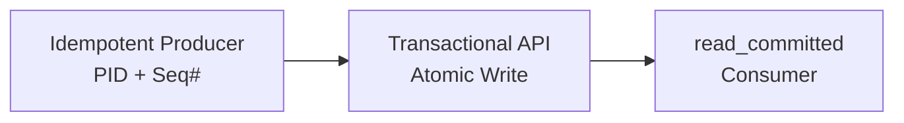
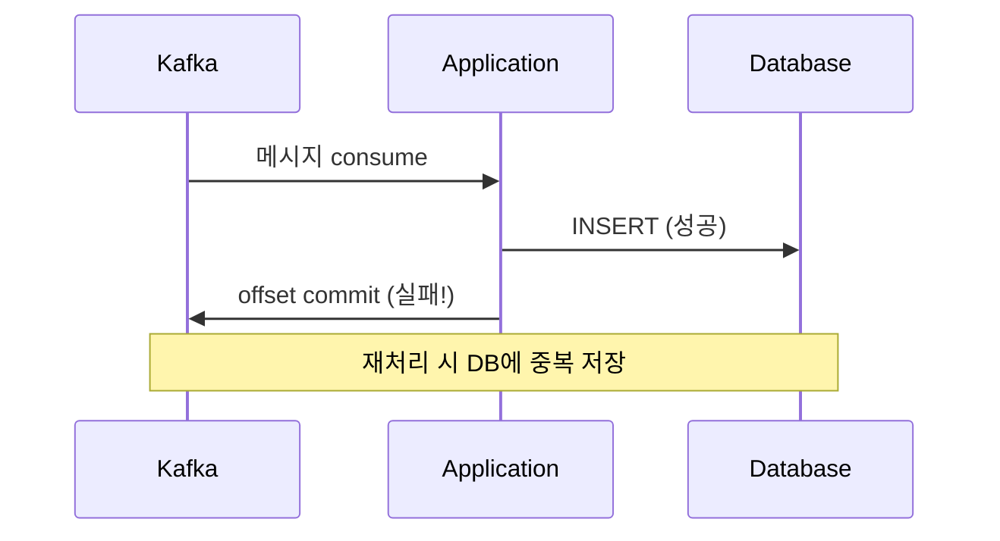
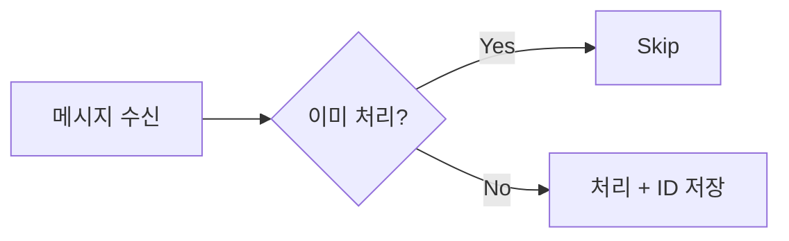

Kafka의 Exactly-Once Semantics(EOS)는 0.11 버전(2017)부터 공식 지원된다. 하지만 "exactly-once"라는 이름이 주는 인상과 실제 보장 범위 사이에는 상당한 간극이 있다.

이 글에서는 EOS가 실제로 무엇을 보장하는지, 왜 현실에서 적용이 어려운지, 그리고 실무에서 어떤 대안을 선택해야 하는지 정리한다.

## "Delivery"가 아니라 "Semantics"다

> "Exactly-once semantics does not mean exactly-once delivery. Messages may be delivered more than once, but the effect is as if they were delivered exactly once."
> — Kafka Documentation

이 구분이 핵심이다. 메시지가 물리적으로 한 번만 전달되는 게 아니다. 재전송은 일어나지만, 중복을 감지해서 **결과적으로 한 번 처리한 것과 같은 효과**를 만드는 것이다.

본질적으로 idempotency 기반이다.

## Kafka가 제공하는 3가지 메커니즘



**1. Idempotent Producer**

Producer에 고유한 PID(Producer ID)와 Sequence Number를 부여한다. 브로커는 이 정보로 중복 쓰기를 감지해 제거한다.

```properties
enable.idempotence=true
```

이 한 줄로 Producer 측 중복 방지가 활성화된다. 단, 같은 Producer 세션 내에서만 동작한다.

**2. Transactional API**

여러 파티션에 대한 쓰기와 컨슈머 오프셋 커밋을 하나의 원자적 트랜잭션으로 묶는다. consume-transform-produce 패턴에서 핵심이다.

```properties
transactional.id=my-app-partition-0
```

**3. Consumer `read_committed`**

커밋된 트랜잭션의 메시지만 읽는다. 아직 진행 중이거나 abort된 트랜잭션의 메시지는 건너뛴다.

```properties
isolation.level=read_committed
```

이 세 가지를 조합하면 **Kafka-to-Kafka** 범위에서 exactly-once가 성립한다. Kafka Streams가 대표적인 사용 예다.

## 현실에서 어려운 5가지 이유

### 1. 외부 시스템 경계에서 깨진다



핵심 문제다. Kafka → DB 저장, Kafka → HTTP API 호출 같은 경우, Kafka 트랜잭션이 커밋되었는데 DB 쓰기가 실패하거나, DB는 썼는데 오프셋 커밋이 실패하는 상황이 발생한다.

두 시스템 간의 원자성을 Kafka 혼자 보장하지 못한다. 이건 분산 시스템의 근본적인 한계다.

### 2. Producer 재시작 시 transactional.id 관리

같은 `transactional.id`를 써야 zombie fencing이 동작한다. 이전 세션의 Producer가 아직 살아있는 것처럼 보이는 zombie를 차단하는 메커니즘이다.

문제는 스케일아웃이나 재배포 시 이 ID를 어떻게 할당하느냐다. 파티션별로 고정 ID를 부여하는 전략이 일반적이지만, 컨슈머 리밸런싱과 맞물리면 운영 복잡도가 급격히 올라간다.

### 3. 성능 비용

| 항목 | 오버헤드 |
|------|---------|
| Transaction Coordinator 통신 | 추가 네트워크 라운드트립 |
| 2-Phase Commit | 쓰기 레이턴시 증가 |
| 트랜잭션 로그 마커 | 디스크 I/O 증가 |
| Consumer 필터링 | read_committed에서 버퍼링 필요 |

처리량이 중요한 시스템에서 이 비용은 무시하기 어렵다. 트랜잭션 단위가 작을수록 상대적 오버헤드가 커진다.

### 4. Two Generals Problem

> "네트워크로 연결된 두 노드가 합의에 도달했는지를 100% 확신하는 것은 이론적으로 불가능하다."

분산 시스템의 근본적 한계다. Kafka의 EOS도 이 한계 안에서 "충분히 실용적인" 수준을 달성한 것이지, 수학적으로 완벽한 보장은 아니다. 네트워크 파티션, 브로커 장애 등 극단적 상황에서는 여전히 엣지 케이스가 존재한다.

### 5. Kafka Streams 바깥에서의 복잡도

Kafka Streams는 EOS를 잘 추상화해 놓았다. `processing.guarantee=exactly_once_v2` 설정 하나로 활성화된다.

하지만 직접 Consumer/Producer API를 사용하면 상황이 다르다.

1. 트랜잭션 시작 (`beginTransaction`)
2. 메시지 consume
3. 비즈니스 로직 처리
4. 결과 produce
5. 오프셋을 트랜잭션에 포함 (`sendOffsetsToTransaction`)
6. 트랜잭션 커밋 (`commitTransaction`)
7. 에러 시 abort (`abortTransaction`)

이 과정에서 에러 핸들링, 재시도 로직, timeout 관리를 직접 구현해야 한다. 실수할 여지가 많다.

## 실무에서의 선택

| 상황 | 전략 | 복잡도 |
|------|------|--------|
| Kafka → Kafka (Streams) | EOS 사용 | 낮음 |
| Kafka → DB | 컨슈머 측 idempotency key | 중간 |
| Kafka → 외부 API | idempotency key + 재시도 | 중간 |
| DB + Kafka 동시 쓰기 | Outbox 패턴 | 높음 |

### 컨슈머 측 멱등성이 가장 현실적이다



대부분의 실무 환경에서는 EOS에 의존하기보다 **컨슈머 측에서 멱등성을 보장**하는 것이 더 견고하다. 메시지에 고유한 idempotency key를 포함하고, 처리 전에 이미 처리된 메시지인지 확인한다.

이 방식은 Kafka뿐 아니라 어떤 메시지 시스템을 쓰더라도 동작한다. 인프라에 종속되지 않는 범용적인 해결책이다.

## 정리

Kafka EOS는 **Kafka-to-Kafka 범위에서 동작하는 강력한 기능**이다. Kafka Streams를 사용한다면 적극 활용할 만하다.

하지만 외부 시스템이 개입되는 순간, EOS만으로는 부족하다. 결국 **컨슈머 측 멱등성 설계**가 가장 현실적이고 범용적인 답이다. "exactly-once delivery는 불가능하지만, exactly-once processing은 설계로 달성한다"가 핵심 원칙이다.
