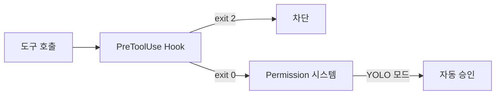
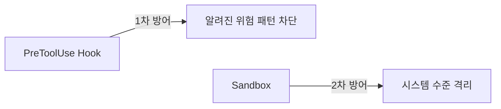

Claude Code Agent Teams를 iTerm2 + tmux 환경에서 활용하면, 에이전트 수와 역할에 맞춰 tmux pane이 자동으로 분할되고 각 pane에서 병렬 작업이 수행된다.

이 과정에서 가장 먼저 부딪히는 문제가 **yes/no 권한 프롬프트**다.

## 문제: 멀티 에이전트에서 권한 프롬프트가 막힌다

Claude Code는 기본적으로 파일 수정이나 명령어 실행 시 사용자 확인을 요구한다.

```
Claude wants to run: ./gradlew test
Allow? (y/n)
```

단일 세션이면 `y`를 누르면 된다. 하지만 멀티 에이전트 환경에서는 여러 pane에서 동시에 프롬프트가 뜬다. 일일이 처리하는 것은 불가능하다.

## 해결: `--dangerously-skip-permissions`

```bash
claude --dangerously-skip-permissions
```

이 플래그로 리드 세션을 실행하면 **모든 팀메이트도 동일한 권한을 상속**한다. yes/no 자체가 발생하지 않는다.

하지만 이름에 "dangerously"가 들어간 데는 이유가 있다. 에이전트가 `rm -rf /`, `git push --force`, `.env` 파일 수정 같은 위험한 작업을 아무 제약 없이 실행할 수 있다.

## PreToolUse Hook: 안전한 YOLO 모드

핵심 발견이 있다.

> **PreToolUse Hook은 권한 시스템보다 먼저 실행된다.**
> `--dangerously-skip-permissions`를 사용해도 Hook은 여전히 동작한다.



Hook이 1차 방어선 역할을 하고, `--dangerously-skip-permissions`가 나머지를 자동 승인한다. 결과적으로 **위험한 것만 차단하고, 나머지는 프롬프트 없이 통과**시킨다.

## 설정 방법

### 1. 가드레일 스크립트 작성

위험한 Bash 명령어를 차단하는 스크립트다.

```bash
#!/bin/bash
# ~/.claude/hooks/guard-dangerous-commands.sh

INPUT=$(cat)
TOOL_NAME=$(echo "$INPUT" | jq -r '.tool_name')

if [ "$TOOL_NAME" != "Bash" ]; then
  exit 0
fi

COMMAND=$(echo "$INPUT" | jq -r '.tool_input.command')

BLOCKED_PATTERNS=(
  "rm -rf /"
  "rm -rf ~"
  "git push --force"
  "git push -f"
  "git reset --hard"
  "DROP TABLE"
  "DROP DATABASE"
  "chmod -R 777"
)

for pattern in "${BLOCKED_PATTERNS[@]}"; do
  if echo "$COMMAND" | grep -qi "$pattern"; then
    echo "Blocked: $COMMAND (pattern: $pattern)" >&2
    exit 2
  fi
done

exit 0
```

보호 대상 파일 수정을 차단하는 스크립트도 만든다.

```bash
#!/bin/bash
# ~/.claude/hooks/guard-protected-files.sh

INPUT=$(cat)
TOOL_NAME=$(echo "$INPUT" | jq -r '.tool_name')

if [ "$TOOL_NAME" != "Write" ] && [ "$TOOL_NAME" != "Edit" ]; then
  exit 0
fi

FILE_PATH=$(echo "$INPUT" | jq -r '.tool_input.file_path')

PROTECTED=(".env" "credentials" "secrets" "id_rsa" "id_ed25519")

for pattern in "${PROTECTED[@]}"; do
  if echo "$FILE_PATH" | grep -qi "$pattern"; then
    echo "Blocked: $FILE_PATH is protected" >&2
    exit 2
  fi
done

exit 0
```

### 2. settings.json에 Hook 등록

```json
{
  "env": {
    "CLAUDE_CODE_EXPERIMENTAL_AGENT_TEAMS": "1"
  },
  "teammateMode": "auto",
  "hooks": {
    "PreToolUse": [
      {
        "matcher": "",
        "hooks": [
          {
            "type": "command",
            "command": "~/.claude/hooks/guard-dangerous-commands.sh"
          },
          {
            "type": "command",
            "command": "~/.claude/hooks/guard-protected-files.sh"
          }
        ]
      }
    ]
  }
}
```

### 3. 실행

```bash
claude --dangerously-skip-permissions
```

이제 에이전트가 `rm -rf`를 시도하면 Hook이 차단하고, 일반 빌드나 테스트는 프롬프트 없이 실행된다.

## prompt 타입 Hook도 있다

command 타입 외에 **prompt 타입** Hook도 지원된다. LLM이 조건을 직접 평가한다.

```json
{
  "hooks": {
    "PreToolUse": [
      {
        "matcher": "Edit|Write",
        "hooks": [
          {
            "type": "prompt",
            "prompt": "Check if the file name does not contain `do_not_edit`: $ARGUMENTS."
          }
        ]
      }
    ]
  }
}
```

[sambaiz.net의 실험](https://www.sambaiz.net/en/article/548/)에서 이 설정으로 `do_not_edit.txt` 파일 수정을 차단하는 데 성공했다. Claude는 차단 이유를 이해하고 대안을 제시한다.

| 타입 | 장점 | 단점 |
|------|------|------|
| command | 빠르고 정확 | 정해진 패턴만 차단 |
| prompt | 유연한 판단 | 토큰 소모, 오판 가능 |

## Hook의 한계

완벽하진 않다.

1. **병렬 실행**: 여러 Hook이 동시에 실행되므로, prompt Hook이 차단해도 command Hook은 실행된다
2. **우회 가능성**: 모든 위험 패턴을 사전에 정의하기 어렵다
3. **창의적 우회**: LLM이 예상치 못한 방법으로 제한을 피할 수 있다

sambaiz.net은 이 한계를 인정하며 **Sandbox 병행 사용**을 권장한다.



## 다른 선택지들

Hook 없이도 yes/no 문제를 줄이는 방법이 있다.

### `permissions.allow`로 사전 허용

```json
{
  "permissions": {
    "allow": [
      "Bash(./gradlew *)",
      "Bash(npm *)",
      "Read",
      "Edit(./src/**)",
      "Glob",
      "Grep"
    ],
    "deny": [
      "Bash(rm -rf *)",
      "Bash(git push --force *)"
    ]
  }
}
```

허용된 도구만 자동 승인되고, 나머지는 프롬프트가 뜬다. `--dangerously-skip-permissions`보다 안전하지만, 허용 목록 관리가 필요하다.

### 읽기 전용 에이전트 활용

코드 리뷰, 컨벤션 검사 같은 읽기 작업에는 **Explore** 타입 에이전트를 쓰면 권한 프롬프트 자체가 발생하지 않는다.

| 에이전트 타입 | 권한 프롬프트 | 적합한 작업 |
|--------------|-------------|------------|
| Explore | 없음 | 리뷰, 분석, 탐색 |
| Plan | 없음 | 설계, 계획 |
| general-purpose | 발생 가능 | 구현, 수정, 실행 |

## 정리

| 방법 | 안전성 | 편의성 | 추천 |
|------|--------|--------|------|
| `--dangerously-skip-permissions` + PreToolUse Hook | 높음 | 높음 | 일상 작업 |
| `--dangerously-skip-permissions` 단독 | 낮음 | 높음 | 데모, 실험 |
| `permissions.allow` 사전 설정 | 높음 | 중간 | Hook 설정이 번거로운 경우 |
| 읽기 전용 에이전트 | 매우 높음 | 높음 | 리뷰, 분석 |

yes/no를 "처리"하는 스크립트를 만들 필요는 없다. 권한 프롬프트가 **발생하지 않도록** 설정하는 것이 정답이다. 그 위에 Hook으로 가드레일을 설치하면, 편의성과 안전성을 동시에 확보할 수 있다.

## 참고 자료

- [Blocking dangerous operations with Claude Code Hooks when using --dangerously-skip-permissions](https://www.sambaiz.net/en/article/548/) — sambaiz.net
- [Claude Code Hooks 공식 문서](https://code.claude.com/docs/en/hooks)
- [Claude Code Permissions 공식 문서](https://code.claude.com/docs/en/permissions)
- [Claude Code Agent Teams 공식 문서](https://docs.anthropic.com/en/docs/claude-code/agent-teams)
- [disler/claude-code-damage-control](https://github.com/disler/claude-code-damage-control) — 위험 명령 차단 Hook 컬렉션
- [How I Tamed Claude Code with Pre-Tool Hooks](https://dev.to/anand_rathnas_d5b608cc3de/how-i-tamed-claude-code-with-pre-tool-hooks-and-you-should-too-3nh1) — DEV Community
