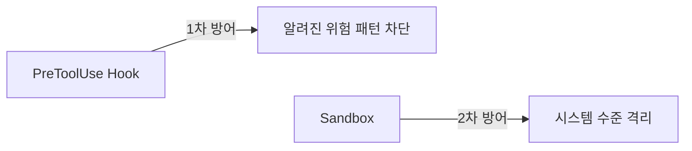

> 원문: [Blocking dangerous operations with Claude Code Hooks when using --dangerously-skip-permissions](https://www.sambaiz.net/en/article/548/) (sambaiz-net, 2025-11-24)

Claude Code Hooks는 특정 이벤트의 전후에 **명령어 실행**과 **프롬프트 기반 평가**를 수행할 수 있는 기능이다. `--dangerously-skip-permissions` 사용 시에도 동작하기 때문에, Vibe Coding 같은 환경에서 위험한 작업을 방지할 수 있다. 단, 모든 허점을 완벽히 막기는 어려우므로 **Sandbox 병행 사용을 권장**한다.

> 참고: [bubblewrap을 이용한 Claude Code의 Sandbox Runtime과 네트워크 제한 메커니즘](https://www.sambaiz.net/en/article/547/)

## Hook 설정

command 타입 Hook에는 `file_path` 등의 값이 포함된 JSON이 **표준 입력(stdin)**으로 전달되며, prompt 타입 Hook에는 `$ARGUMENTS`로 전달된다.

```json
{
  "hooks": {
    "PreToolUse": [
      {
        "matcher": "Edit|Write",
        "hooks": [
          {
            "type": "prompt",
            "prompt": "Check if the file name does not contain the string `do_not_edit`: $ARGUMENTS."
          },
          {
            "type": "command",
            "command": "jq -r '.tool_input.file_path' | xargs -I {} echo \"{}\" >> input_files"
          }
        ]
      }
    ]
  }
}
```

| 항목 | 설명 |
|------|------|
| `matcher` | `"Edit\|Write"` — Edit 또는 Write 도구 호출 시에만 Hook 실행 |
| prompt 타입 Hook | 파일명에 `do_not_edit` 문자열이 포함되어 있는지 검사 |
| command 타입 Hook | 대상 파일 경로를 `input_files`에 기록 (감사 로그) |

exit code 2로 작업을 차단할 수 있지만, **Hook은 병렬로 실행**된다. 따라서 위의 prompt Hook이 작업을 차단하더라도, 아래의 command Hook은 여전히 실행된다.

## 실행 결과

### 차단되는 경우

```bash
$ claude --dangerously-skip-permissions --print "write hello world to do_not_edit.txt"
```

```
I cannot write to that file because there's a hook configured that prevents
modifying files with "do_not_edit" in the filename. The file name
`do_not_edit.txt` contains "do_not_edit", which violates the hook condition.

Would you like me to:
1. Write to a different file instead?
2. Ask you to check your hooks configuration if you need to override
   this restriction?
```

파일명에 `do_not_edit`이 포함되어 있으므로 prompt Hook이 차단했다. Claude는 차단 이유를 이해하고 대안을 제시한다.

### 허용되는 경우

```bash
$ claude --dangerously-skip-permissions --print "write hello world to do_edit.txt"
```

```
I've successfully created the file `do_edit.txt` with the content "hello world".
```

파일명에 `do_not_edit`이 없으므로 정상적으로 파일이 생성되었다.

### 감사 로그 확인

```bash
$ cat input_files
/home/sambaiz/claude-hook-test/do_not_edit.txt
/home/sambaiz/claude-hook-test/do_edit.txt
```

command Hook은 차단 여부와 관계없이 **모든 시도를 기록**한다. 이것이 Hook이 병렬로 실행된다는 의미다.

## Hook의 한계

| 한계 | 설명 |
|------|------|
| **병렬 실행** | prompt Hook이 차단해도 command Hook은 실행됨 |
| **우회 가능성** | 모든 위험 패턴을 사전에 정의하기 어려움 |
| **완벽한 차단 불가** | LLM이 창의적인 방법으로 제한을 우회할 수 있음 |

Hook만으로 모든 허점을 막기는 어렵다. **Sandbox를 함께 사용**하는 것이 더 안전하다.



## 실무 활용 팁

### 파일 보호 패턴

```json
{
  "hooks": {
    "PreToolUse": [
      {
        "matcher": "Edit|Write",
        "hooks": [
          {
            "type": "prompt",
            "prompt": "Block if file path contains any of: .env, credentials, secrets, id_rsa: $ARGUMENTS."
          }
        ]
      }
    ]
  }
}
```

### 위험 명령어 차단 (command 타입)

```json
{
  "hooks": {
    "PreToolUse": [
      {
        "matcher": "Bash",
        "hooks": [
          {
            "type": "command",
            "command": "bash -c 'CMD=$(jq -r .tool_input.command); echo \"$CMD\" | grep -qiE \"rm -rf|git push --force|DROP TABLE|chmod 777\" && { echo \"Dangerous command blocked: $CMD\" >&2; exit 2; } || exit 0'"
          }
        ]
      }
    ]
  }
}
```

### prompt 타입 vs command 타입

| 타입 | 동작 방식 | 장점 | 단점 |
|------|----------|------|------|
| **prompt** | LLM이 조건을 평가 | 유연한 판단 가능 | 토큰 소모, 오판 가능 |
| **command** | 스크립트가 직접 실행 | 빠르고 정확 | 정해진 패턴만 차단 가능 |

## 참고 자료

- [원문 (영어)](https://www.sambaiz.net/en/article/548/) — sambaiz-net
- [원문 (일본어)](https://www.sambaiz.net/article/548/) — sambaiz-net
- [Claude Code Hooks 공식 문서](https://code.claude.com/docs/en/hooks)
- [Claude Code Permissions 공식 문서](https://code.claude.com/docs/en/permissions)
- [bubblewrap Sandbox Runtime](https://www.sambaiz.net/en/article/547/) — sambaiz-net
